# 🚀 Interactive Study & Interview Guides

> Open the HTML guides directly in your browser.  
> Audio and interactive functions work best in Chrome.

## ⚡ Spark, Flink & Big Data

- [Spark Interview Preparation](https://htmlpreview.github.io/?https://github.com/blaire101/Spark-Journey-2025/blob/main/spark_prep_with_flink_sql_tabs.html)
- [Flink SQL Study Guide](https://htmlpreview.github.io/?https://github.com/blaire101/Spark-Journey-2025/blob/main/dw-flink-sql.html)
- [Big Data SRE Guide](https://htmlpreview.github.io/?https://github.com/blaire101/Spark-Journey-2025/blob/main/big-data-sre.html)

## 🏗️ Data Warehouse & Data Governance

- [Data Warehouse STAR Projects](https://htmlpreview.github.io/?https://github.com/blaire101/Spark-Journey-2025/blob/main/dw_projects_star.html)

## ☁️ AWS, Azure & Microsoft Fabric

- [AWS_Reservation_DM_CloudFormation](https://htmlpreview.github.io/?https://github.com/blaire101/Spark-Journey-2025/blob/main/AWS_Reservation_DM_CloudFormation.html)
- [AWS Data Engineer Associate Study Guide](https://htmlpreview.github.io/?https://github.com/blaire101/Spark-Journey-2025/blob/main/aws-dea-c01-study-guide.html)
- [AWS vs Azure Data Engineering Comparison](https://htmlpreview.github.io/?https://github.com/blaire101/Spark-Journey-2025/blob/main/aws_azure_chanel_data_engineering_comparison_azure_learning_qa.html)
- [Azure Fabric Real Console Case](https://htmlpreview.github.io/?https://github.com/blaire101/Spark-Journey-2025/blob/main/aws_azure_chanel_fabric_real_console_case_tabbed.html)

## 💼 Interview Preparation

- [H-DE Interview Prep](https://htmlpreview.github.io/?https://github.com/blaire101/Spark-Journey-2025/blob/main/H_SDE_Preparation.html)
- [LeetCode Preparation](https://htmlpreview.github.io/?https://github.com/blaire101/Spark-Journey-2025/blob/main/gs_leetcode_prep.html)

## 🤖 AI, LLM & LangChain

- [LangChain_LLM_Agent_Demo](https://htmlpreview.github.io/?https://github.com/blaire101/Spark-Journey-2025/blob/main/LangChain_LLM_Agent_Demo.html)
- [AI Agent Study Guide](https://htmlpreview.github.io/?https://github.com/blaire101/Spark-Journey-2025/blob/main/README-ai-agent.html)
- [LangChain Course Outline](https://htmlpreview.github.io/?https://github.com/blaire101/Spark-Journey-2025/blob/main/langchain-course-outline.html)

<details>
<summary>💬 Spark basic questions</summary>

**The Key Insight:**

| | Single-stage | Two-stage |
|---|---|---|
| Memory model | One giant HashSet | Many small groups |
| Spillable | No | Yes |
| OOM risk | High | Low |
| Speed | Faster (small data) | Stable (large/skewed data) |

> The real benefit is not speed — it's **converting unspillable memory structures into spillable ones**, so Spark can handle skewed keys without crashing.

# Spark Interview Quick Reference

---

## 1. Core Concepts

| Concept | One-Line Answer | Key Points |
|---|---|---|
| **What is Spark?** | Distributed computing engine, in-memory, DAG-based, faster than MapReduce | Supports Python, Scala, Java, SQL |
| **RDD** | Immutable, partitioned, distributed collection. Low-level API | Supports `map`, `filter`, `reduceByKey` |
| **DataFrame** | Distributed table with schema, optimized by Catalyst | Like distributed Pandas, faster than RDD |
| **Lazy Evaluation** | Builds DAG of transformations, executes only when action is called | Transformation = lazy, Action = triggers execution |
| **Transformation** | Lazy operation producing new RDD/DataFrame | `map`, `filter`, `groupBy` |
| **Action** | Triggers actual computation, returns result | `collect`, `count`, `show`, `save` |

---

## 2. Execution Model

| Concept | One-Line Answer | Key Points |
|---|---|---|
| **Job** | Triggered by an action | One action = one job |
| **Stage** | Set of tasks between shuffle boundaries | Split by wide transformations |
| **Task** | Unit of execution on one partition | One partition = one task |
| **DAGScheduler** | Converts DAG into stages | Splits at shuffle boundaries |
| **TaskScheduler** | Assigns tasks to executors | Handles retries and locality |
| **Driver** | Coordinates execution, collects results | Runs your `main()` code |
| **Executor** | Runs tasks on worker nodes | Has thread pool for parallel tasks |

**Memory formula:**
> Action → Job → Stage → Task → Executor

---

## 3. Catalyst Optimizer

| Step | What Happens |
|---|---|
| **Logical Plan** | Parse SQL/DataFrame into unresolved plan |
| **Analyzed Plan** | Resolve column names, check schema |
| **Optimized Plan** | Apply rules: predicate pushdown, column pruning, join reordering |
| **Physical Plan** | Choose operators: HashAggregate vs SortMergeJoin |

---

## 4. Shuffle

| Concept | One-Line Answer | Key Points |
|---|---|---|
| **What is shuffle?** | Data redistribution across partitions | Expensive: disk I/O + network + serialization |
| **Why expensive?** | Data must move across nodes | Serialization + network transfer + disk write |
| **Narrow transformation** | Each parent partition → one child partition | No shuffle: `map`, `filter`, `union` |
| **Wide transformation** | Parent partitions → multiple child partitions | Shuffle needed: `groupBy`, `join`, `reduceByKey` |

---

## 5. Data Skew

| Skew Type | Cause | Solution |
|---|---|---|
| **Input files** | Many small files or one huge file | Repartition, merge small files, use Parquet |
| **Join keys** | Hot key appears millions of times | Broadcast join, salting, AQE |
| **Aggregation keys** | Hot key dominates GROUP BY | Two-stage aggregation + salting |
| **General** | Uneven partition sizes | AQE, tune shuffle partitions |

**Symptoms:**
| Symptom | Meaning |
|---|---|
| One task runs much longer | Data skew |
| Executor OOM | HashSet explosion on hot key |
| High shuffle read time | I/O bottleneck, not CPU |
| GC pauses | Memory pressure |

---

## 6. Two-Stage Aggregation

| | Single-Stage | Two-Stage |
|---|---|---|
| **Memory model** | One giant HashSet per group | Many small spillable groups |
| **Spillable** | No | Yes |
| **OOM risk** | High | Low |
| **Speed** | Faster (small data) | Stable (large/skewed data) |

**Two steps:**

| Stage | SQL | What happens |
|---|---|---|
| **Stage 1** | `GROUP BY (key, sender_id)` | Deduplicate sender_id first |
| **Stage 2** | `GROUP BY (key) → COUNT(*)` | Count deduplicated rows |

**Why it works:**
> Converts one unspillable giant HashSet → many small spillable sorted groups

---

## 7. Salting

| Step | What happens |
|---|---|
| **Identify hot key** | e.g. `US+Wise+USD` with 4M records |
| **Add salt bucket** | `hash(sender_id) % 8` → buckets 0-7 |
| **Stage 1** | Each bucket goes to separate reducer |
| **Stage 2** | Merge results from all buckets |

**Important rule:**
> Salt must be deterministic based on the distinct key (not random per row), otherwise COUNT(DISTINCT) will be wrong

**Salting vs AQE:**

| | AQE | Salting |
|---|---|---|
| **Timing** | After shuffle (runtime) | Before shuffle (logical rewrite) |
| **Implementation** | Automatic | Manual SQL change |
| **Best for** | Mild skew | Known extreme hot keys |
| **Limitation** | Cannot rebalance single extreme hot key | Requires knowing hot keys in advance |

---

## 8. HashAgg vs SortAgg

| | HashAggregate | SortAggregate |
|---|---|---|
| **Memory** | High (in-memory HashSet) | Low (disk spillable) |
| **OOM risk** | High | Low |
| **Speed** | Faster for small data | Stable for large/skewed data |
| **Use when** | No skew, small data | Skewed data, large data |

---

## 9. AQE (Adaptive Query Execution)

| Function | What it does | Benefit |
|---|---|---|
| **Coalesce partitions** | Merges small shuffle partitions at runtime | Fewer tasks, less overhead |
| **Skew join split** | Splits large skewed partitions into multiple tasks | Eliminates long-tail tasks |
| **Switch join strategy** | SortMergeJoin → BroadcastHashJoin at runtime | Better performance |

**AQE limitation:**
> Can split partitions but cannot rebalance a single extreme hot key. Manual salting still needed for extreme cases.

---

## 10. Join Strategies

| Strategy | When to use | How it works |
|---|---|---|
| **BroadcastHashJoin** | Small table < 10MB | Send small table to all executors, no shuffle |
| **SortMergeJoin** | Both tables large | Sort both sides, merge on key |
| **ShuffleHashJoin** | One side fits in memory | Hash the smaller side, probe with larger |

## 12. Quick Answers

| Question | Answer (say this first) |
|---|---|
| What is Spark? | Distributed in-memory computing engine, DAG-based, faster than MapReduce |
| What is shuffle? | Data redistribution across partitions. Expensive: disk I/O + network + serialization |
| What is data skew? | Unbalanced data across partitions. Causes OOM and long-tail tasks |
| How did you solve skew? | Two-stage aggregation + targeted salting + AQE. 75min→13min |
| What is AQE? | Runtime optimization: coalesces small partitions, splits skewed ones, switches join strategies |
| HashAgg vs SortAgg? | HashAgg faster but OOM risk. SortAgg spillable, stable for skewed data |
| What is lazy evaluation? | Transformations build a DAG. Nothing executes until an action is called |
| What is Catalyst? | Spark's query optimizer. SQL → Logical → Analyzed → Optimized → Physical Plan |

</details>
  
## 📚 Table of Contents

- [Chap 1. Apache Spark Core Concepts](#-1-apache-spark-core-concepts)
- [Chap 2. Execution Model](#-2-execution-model)
- [Chap 3. Shuffle & Partitioning](#-3-shuffle--partitioning)
- [Chap 4. Data Skew（Skewness）](#4-data-skewskewness)
- [Chap 5. General Spark Tuning (Skew Indirectly Helpful)](#5-general-spark-tuning-skew-indirectly-helpful)
- [Chap 6. ❓ Spark QA](#6--spark-qa)

Apache Spark (Distributed computing engine)

## 🟩 1. Apache Spark Core Concepts
📌 **RDD, DataFrame, Lazy evaluation · Fault-tolerance mechanisms** /fɔːlt/ /ˈtɒlərəns/ /ˈmekənɪzəmz/

| No. | ❓Question | ✅ Answer | 📘 Notes |
| --- | --- | --- | --- |
| 1 | **What is Apache Spark?** | A distributed computing engine for large-scale data processing. | Supports in-memory computation and APIs in Scala, Python, Java, SQL. |
| 2 | **What is an RDD?** | An immutable, partitioned, distributed collection of objects. | Immutability stabilises parallel computation and simplifies fault tolerance.    supports transformations like `map`, `filter`, `reduceByKey`. |
| 3 | **What is a DataFrame?** | A distributed table with named columns and typed rows. | Built on RDDs; optimized by the Catalyst optimizer; like a distributed Pandas/DataTable. |
| 4 | **What is a transformation?** | A lazy operation producing a new RDD or DataFrame. **<mark>Narrow transformations + Wide transformations</mark>** | Examples: `map()`, `filter()`, `groupBy()`. |
| 5 | **What is an action?** | An operation that triggers actual computation and returns results. | Examples: `collect()`, `count()`, `show()`. |
| 6 | **What is lazy evaluation?** | Spark builds a **<mark>logical DAG of transformations</mark>**, which is only executed when **an action is called**. | Enables optimization and fault tolerance. |

- Spark builds a <mark>**logical DAG of transformations**</mark> when you define operations, but it does not execute them immediately.

### 1️⃣ Compile phase : User Program → Logical/Physical Plan → RDD DAG

```mermaid
flowchart LR
    A[**User Program**<br/>DataFrame/SQL / RDD] --> B[**SparkSession**]

    %% Catalyst Optimizer subgraph
    subgraph C[**Catalyst Optimizer**]
        direction TB
        C1[**Logical Plan**<br/>Parsed from SQL]
        C2[**Analyzed Logical Plan**<br/>Resolved with metadata]
        C3[**Optimized Logical Plan**<br/>Catalyst rules: predicate pushdown, column pruning]
        C4[**Physical Plan**<br/>Operators decided: HashAggregate / SortMergeJoin]

        C1 --> C2 --> C3 --> C4
    end

    B --> C1
    C4 --> X[**DAG of Transformations**<br/>RDD Lineage]

    X -.-> Y[Ac]

    %% === Color classes ===
    classDef user fill:#fce5ff,stroke:#666,stroke-width:1px;
    classDef context fill:#e6f0ff,stroke:#666,stroke-width:1px;
    classDef logical fill:#e6f0ff,stroke:#333,stroke-width:1px;
    classDef analyzed fill:#d9f0ff,stroke:#333,stroke-width:1px;
    classDef optimized fill:#e6ffe6,stroke:#333,stroke-width:1px;
    classDef physical fill:#fff2cc,stroke:#333,stroke-width:1px;
    classDef dag fill:#fff2cc,stroke:#666,stroke-width:1px;

    %% Assign styles
    class A user;
    class B context;
    class C1 logical;
    class C2 analyzed;
    class C3 optimized;
    class C4 physical;
    class X dag;

    %% Make Action node black & white
    style Y fill:#ffffff,stroke:#000000,stroke-width:1px;
```

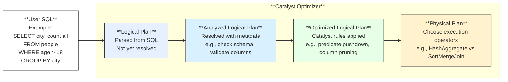

1. **User Program (DataFrame / SQL / RDD)**

   * The developer writes Spark code using DataFrames, SQL, or RDD APIs.

2. **SparkSession**

   * Entry point of Spark. <mark>**Translates**</mark> user code into Spark’s internal representations.
   * SparkSession is the <mark>**bridge**</mark> between the **user world (DataFrame / SQL / RDD APIs)** and **Spark’s internal world (Plans / DAGs / Tasks)**.

3. **Catalyst Optimizer (Logical → Physical Plan)**

   * Spark uses Catalyst to optimize SQL/DataFrame queries.
   * It creates a **Logical Plan**, applies optimization rules, and produces a **Physical Plan**, 

4. **DAG of Transformations (RDD DAG - RDD Lineage is Lineage Graph)**

   * From the physical plan, Spark builds a **Directed Acyclic Graph (DAG)** of transformations.
   * The DAG represents dependencies between RDDs.  for example: **map → filter → join**

5. Lazy Execution until Action

   * Transformations are only recorded.
   * Nothing runs until an Action (e.g., collect, count, save) is triggered.

<details>
<summary><strong>Spark Code - Lazy Execution until Action</strong></summary>

```python
from pyspark.sql import SparkSession
from pyspark.sql.functions import length, col

# ✅ Step 0 — Create a SparkSession (Unified entry point in Spark 3.3+)
spark = SparkSession.builder \
    .appName("SparkLazyEvaluationDemo") \
    .master("local[*]") \
    .getOrCreate()

# ✅ Step 1 — Create initial DataFrame (Lazy; logical plan only, not executed yet)
df = spark.createDataFrame(
    [("Spark is fast",), ("Big data",), ("Spark powers analytics",)],
    ["value"]
)
# Conceptual content of df (Spark has not executed anything yet):
# +-------------------------+
# | value                   |
# +-------------------------+
# | Spark is fast           |
# | Big data                |
# | Spark powers analytics  |
# +-------------------------+

# ✅ Step 2 — Apply transformations (Still lazy; no execution yet)
df2 = df.filter(col("value").contains("Spark")) \
        .withColumn("length", length(col("value")))
# Conceptual content of df2 (still lazy, not executed yet):
# +-------------------------+--------+
# | value                   | length |
# +-------------------------+--------+
# | Spark is fast           | 14     |
# | Spark powers analytics  | 24     |
# +-------------------------+--------+

# ✅ Step 3 — Action: show() triggers actual execution
df2.show()

# ✅ Step 4 — Stop SparkSession
spark.stop()
```

```python
from pyspark import SparkContext

sc = SparkContext("local", "LazyEvaluationExample")

# Step 1: Create an RDD (Lazy - no computation yet)
rdd = sc.parallelize(["Spark is fast", "Big data", "Spark powers analytics"])
# RDD content (conceptually): ["Spark is fast", "Big data", "Spark powers analytics"]

# Step 2: Transformation: filter (Lazy)
filtered_rdd = rdd.filter(lambda line: "Spark" in line)
# Conceptual result (not executed yet): ["Spark is fast", "Spark powers analytics"]

# Step 3: Transformation: map (Lazy)
mapped_rdd = filtered_rdd.map(lambda line: (line, len(line)))
# Conceptual result (not executed yet):
# [
#   ("Spark is fast", 14),
#   ("Spark powers analytics", 24)
# ]

# Step 4: Action: collect() (Triggers execution, returns actual results)
result = mapped_rdd.collect()
# Actual result after execution:
# [
#   ("Spark is fast", 14),
#   ("Spark powers analytics", 24)
# ]
print(result)
sc.stop()
```

</details>
    
> In Spark, transformations like **filter** and **map are lazy** — they are only recorded in the DAG and not executed immediately.  
> Actual execution happens only when an action like collect is triggered.
In this example, the **RDD chain is built in steps 1-3**, but **Spark only runs them at step 4**.
     
### 2️⃣ Run Phase : DAG Execution → Driver Result

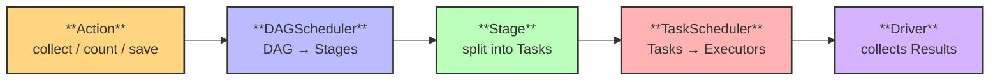

```mermaid
flowchart LR
    A[**Action**<br/>collect, count, save] 
      --> B[**DAGScheduler**<br/>Build Scheduling DAG<br/>Split by shuffle boundaries]
    B --> C[**Stages**<br/>Example:<br/>Stage 1 → Scan and Filter<br/>Stage 2 → Shuffle and Aggregate]
    C --> D[**Tasks**<br/>Each stage has many tasks<br/>One task corresponds to one partition]
    D --> E[**TaskScheduler**<br/>Assign tasks to Executors<br/>Handle retries and locality]
    E --> F[**Driver**<br/>Coordinate execution<br/>Return results to user]

    %% === Color classes ===
    classDef action fill:#ffd580,stroke:#333,stroke-width:2px;
    classDef dag fill:#bbf,stroke:#333,stroke-width:2px;
    classDef stage fill:#bfb,stroke:#333,stroke-width:2px;
    classDef tasks fill:#fce5ff,stroke:#333,stroke-width:2px;
    classDef scheduler fill:#ffb3b3,stroke:#333,stroke-width:2px;
    classDef driver fill:#d5b3ff,stroke:#333,stroke-width:2px;

    %% === Assign classes ===
    class A action;
    class B dag;
    class C stage;
    class D tasks;
    class E scheduler;
    class F driver;
```

> Responsible for: actually executing the tasks and running the DAG.
> Keywords: Action → DAGScheduler → Stages → TaskScheduler → Executors → Driver.

1. **Action (collect / count / save)**

   * When an action is triggered, Spark executes the DAG to actually process the data.
   * Until an action is called, transformations remain **lazy**.

2. **DAGScheduler (DAG → Stages)** <mark>Scheduling DAG</mark> – the actual execution graph of computation tasks.

   * Splits the DAG into **Stages** based on shuffle boundaries.
   * Each stage contains a set of tasks that can run in parallel.

3. **Stage (split into Tasks)**

   * A stage is further divided into multiple **Tasks**, one per partition.

4. **TaskScheduler (Tasks → Executors)**

   * The TaskScheduler assigns tasks to worker nodes (Executors).
   * Handles task retries and scheduling policies.

5. **Driver (collects Results)**

   * The Driver program coordinates execution.
   * Collects results from Executors and returns them to the user program.


> 1. The **<mark>DAG</mark>** is only executed when you call an **<mark>action</mark>** (e.g., `collect`, `count`, `save`).  
> 2. At this point, the **<mark>DAGScheduler</mark>** converts the **<mark>logical DAG</mark>** into a **<mark>DAG of stages</mark>**.  
> 3. Each **<mark>stage</mark>** is then further divided into multiple **<mark>tasks</mark>**.  
> 4. The **<mark>TaskScheduler</mark>** is responsible for **<mark>scheduling</mark>** these **<mark>tasks</mark>** to **<mark>executors</mark>** and **<mark>monitoring</mark>** their execution.  

<div align="center">
  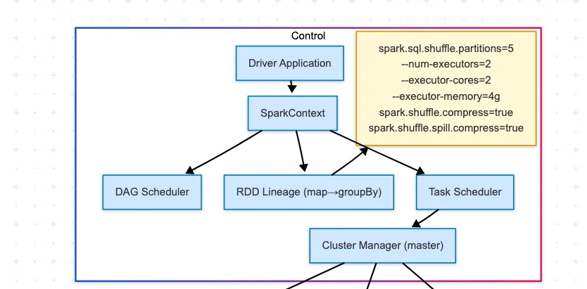
</div>

<details>
<summary><strong>SparkSession</strong></summary>

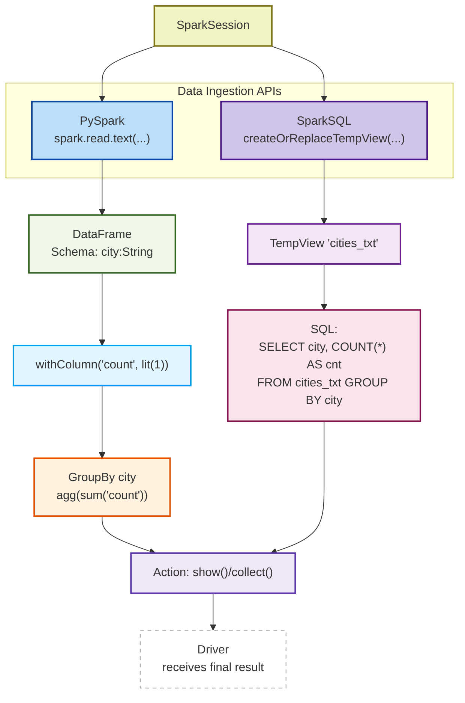

</details>

---

## 🟨 2. Execution Model

### 2.1 📌 **<mark>Job → Stage → Task</mark>**

| No. | Question | Summary |
| --- | --- | --- |
| 7 | What is a Spark job? | Triggered by action ("collect, take(n), saveAsTextFile(path), show..DF"), Spark creates a job - **<mark>consists of stages</mark>**, |
| 8 | What is a stage in Spark? | a set of parallel **tasks** that execute the same computation on different **partitions of the data**. <br> **<mark>A set of tasks</mark>** between shuffles. |
| 9 | What is a task? | **<mark>Unit of execution</mark>** on a partition. |

Stage division： Spark splits the DAG into stages at shuffle operations (like reduceByKey, groupBy, join).

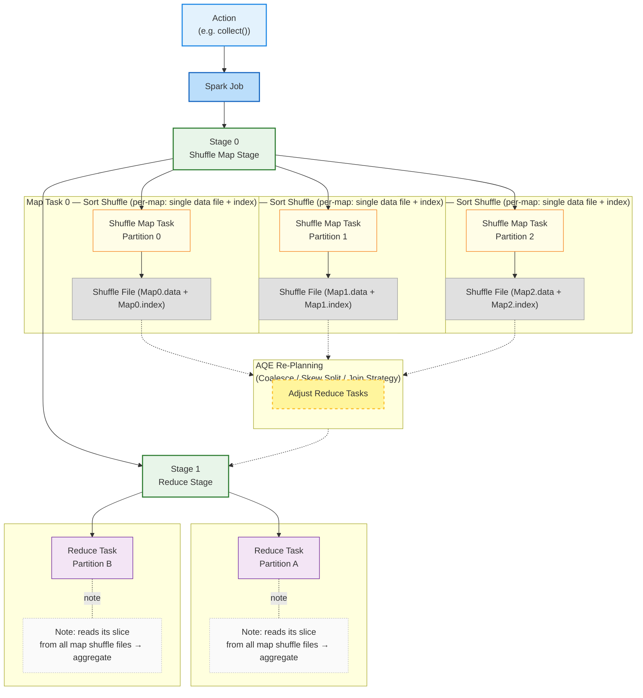

| No. | Question | Summary |
| --- | --- | --- |
| Stage0 | contains narrow transformations (e.g. `map`, `filter`) **and writes shuffle output if followed by a wide transformation** | 👉 Divided into multiple **Tasks**, each processing **one input partition** (e.g. Partition 0, 1, 2), executing all narrow transformations **in parallel**. Shuffle files are written if needed for Stage1. |
| Stage1 | begins **after Stage 0 completes**, involves **wide transformations** (e.g. `reduceByKey`)                                | 👉 Divided into **Tasks** operating on **shuffled partitions** (e.g. Partition A, B). Tasks run **in parallel**, and once Stage 1 completes, the **final result** is returned to the **Driver**.            |

> Wide Dependency : A parent partition may be used by multiple child partitions.

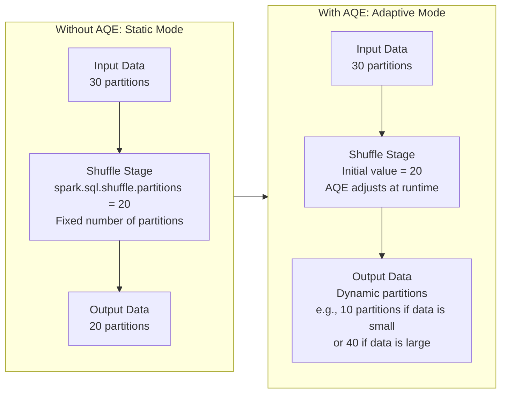

### 2.2 Spark Component

| No. | Component       | What It Does |
| --- |-----------------|-------------|
| 1 | Client | Acts as the client on the user’s behalf, responsible for submitting applications.
| 2 | **Driver**      | Runs your main application code (`main()`), creates the `SparkContext` <br> Responsible for the scheduling of jobs, i.e., the distribution of tasks. Think of it as the “orchestrator” of your Spark job. |
| 3 | **Worker**      | A machine/node in the cluster that runs executors. It follows the driver’s instructions and reports back its status. |
| 4 | **Executor**    | Runs the actual tasks on a worker node. Each executor has a pool of threads to process multiple tasks in parallel. |
| 5 | **Cluster Manager** | Controls the cluster (like the “master controller”). In Standalone mode, it launches workers, monitors them, and helps schedule jobs. |

<div align="center">
  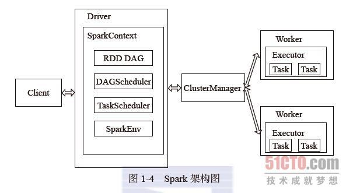
</div>

<details>
<summary><strong>Spark App Process</strong></summary>

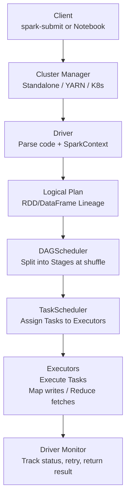

| Step | Keyword / Component              | Description |
|------|----------------------------------|-------------|
| 1    | <mark>**Client Application Submit**</mark>  | User submits the application via <mark>**spark-submit / Notebook**</mark>. |
| 2    | <mark>**Cluster Manager Allocation**</mark> | <mark>**Standalone / YARN / K8s**</mark> allocates resources and launches the Driver. |
| 3    | <mark>**Driver and SparkContext**</mark>    | Driver starts, creates <mark>**SparkContext**</mark>, and parses the user program. |
| 4    | <mark>**DAG of Transformations**</mark>     | User-defined operations (map, filter, join, etc.) are recorded lazily as <mark>**lineage**</mark>. |
| 5    | <mark>**Action Trigger Execution**</mark>   | An <mark>**action**</mark> (collect, count, save) triggers execution of the DAG. |
| 6    | <mark>**DAGScheduler Planning**</mark>      | Converts the transformations DAG into a <mark>**DAG of Stages**</mark>, splitting at <mark>**shuffle boundaries**</mark>. |
| 7    | <mark>**TaskScheduler Dispatch**</mark>     | Breaks each stage into multiple <mark>**tasks**</mark> (by partition) and schedules them on <mark>**Executors**</mark>. |
| 8    | <mark>**Executors Execution**</mark>        | Executors run <mark>**tasks**</mark>, perform <mark>**shuffle read/write**</mark>, and return results. |
| 9    | <mark>**Driver Monitoring & Result**</mark> | Driver monitors <mark>**task execution**</mark>, retries failures, aggregates results, and returns the final <mark>**output**</mark> to the user or storage. |

</details>
  
## 🟧 3. Shuffle & Partitioning

📌 **Shuffle = Costly, Wide vs Narrow**

| # | Question | Summary |
| --- | --- | --- |
| 10 | What is a shuffle in Spark? | Data redistribution across partitions. Data **<mark>redistribution across partitions</mark>**, which may involve moving data between **<mark>Executors (nodes)</mark>** over the **<mark>network</mark>**.  <br><br> This makes it an **<mark>expensive operation</mark>** due to **<mark>disk I/O</mark>**, **<mark>network transfer</mark>**, and **<mark>serialization</mark>**. |
| 11 | Why is shuffle expensive? | Disk I/O + network + serialization. |
| 12 | What is the difference between narrow and wide transformations? | Narrow = no shuffle, Wide = shuffle needed. |

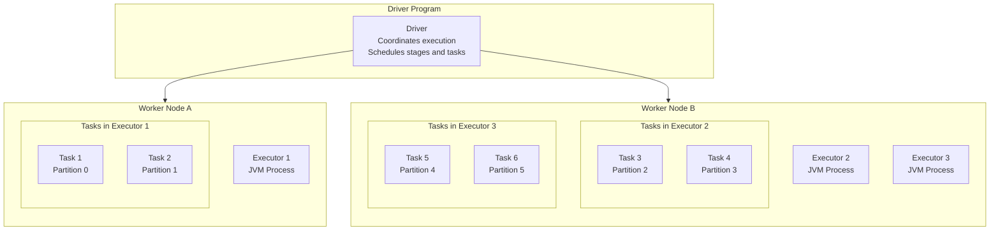

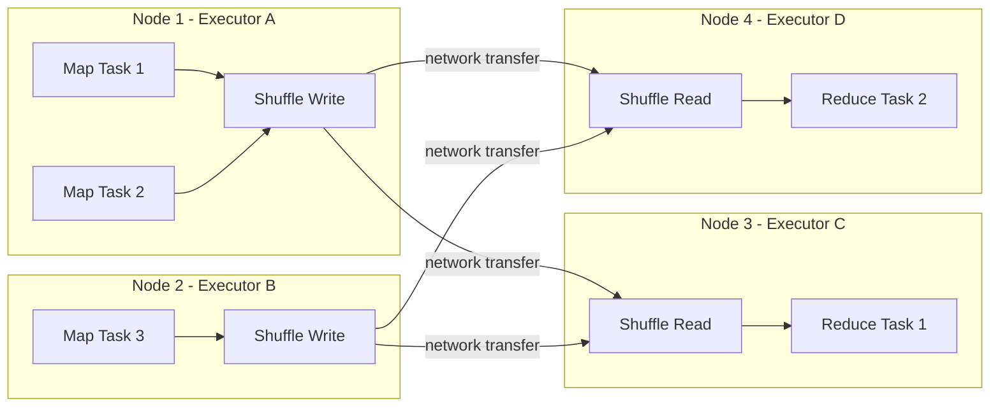

### ✅ Now the flow explains - Serialization :

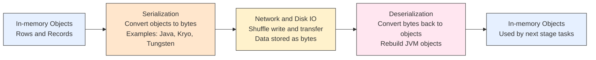

1. **In-memory Objects** → JVM data structures (rows, records).
2. **Serialization** → Converts objects into bytes, using **Java serialization, Kryo, or Tungsten UnsafeRow**.
3. **Network and Disk IO** → Bytes written to shuffle files and transferred across Executors.
4. **Deserialization** → Bytes converted back into JVM objects.
5. **In-memory Objects** → Data ready for the next stage’s tasks.

<details>
<summary><strong>Narrow vs Wide Dependency</strong></summary>

<div align="center">
  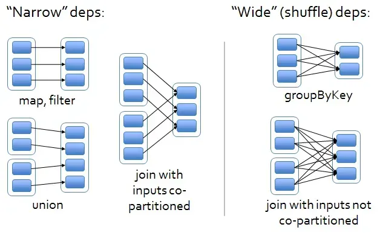
</div>

| No. | ❓Question   | ✅ Answer| 📘 Notes                                                                                                    
| --- | --- | --- | --- |
| 1   | What is a Narrow Dependency in Spark?  | A **narrow dependency** means that **each partition** of the parent RDD is used by **at most one partition** of the child RDD.                            | No shuffle is required. Examples include `map`, `filter`, and `union`. These operations allow pipelined execution and are typically faster and more efficient.           |
| 2   | What is a Wide Dependency in Spark?    | A **wide dependency** means that **multiple partitions** of the parent RDD may be used by **multiple partitions** of the child RDD.                       | This necessitates a shuffle across the cluster, typically seen in operations like `groupBy`, `reduceByKey`, or `join`. It incurs higher overhead and network transfer.   |
| 3   | Why are Wide Dependencies expensive?   | Because they involve **shuffles**, during which data must be **redistributed** across nodes, leading to **disk I/O**, **network transfer**, and **skew**. | Wide dependencies are often the primary bottleneck. Optimisation may require techniques such as salting, repartitioning, or adaptive execution.                         |
| 4   | Can Spark optimise Wide Dependencies?  | Yes, Spark can use **Adaptive Query Execution (AQE)** to detect skew and adjust partitioning dynamically to reduce overhead.                             | Enable configs like `spark.sql.adaptive.enabled` and `spark.sql.adaptive.skewJoin.enabled`. AQE may merge small partitions or split skewed ones to improve performance. |

</details>

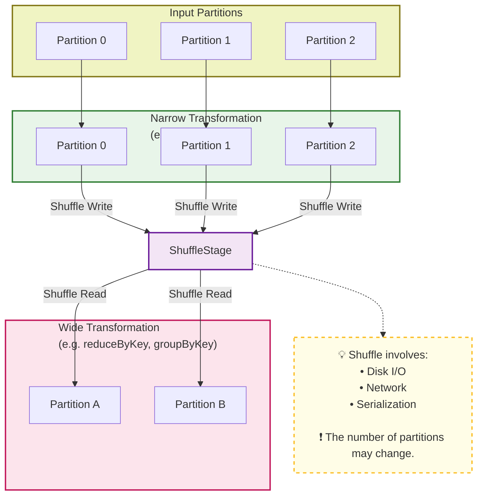

🔁 Task Count Comparison

| Stage   | Task Type | Count | Description 
| --- | --- | --- | --- |
| **Stage 1** | **Shuffle Map Tasks** | **3** | One task per input partition (P0–P2). Each task executes all narrow transformations (map/flatMap/…) in a pipeline, then buckets records by key and writes **2 shuffle outputs** (for partitions A and B). |
| **Stage 2** | **Reduce Tasks**      | **2** | One task per output partition (A, B). **Each reduce task fetches its partition’s blocks from all 3 shuffle map tasks** (one block per map task), then merges/aggregates to produce the final result.      |

## 4. Data Skew（skewness)

🔥 Data Skew in Spark - *Unbalanced data across partitions*

| Category  | Optimization Methods | Notes / Best Practices                       
| --- | --- | --- | 
| 1️⃣ Skewed Input Files         | Repartitioning, **<mark>Merging small files</mark>**, Using columnar file formats (Parquet/ORC), Increasing `spark.sql.files.maxPartitionBytes` <br> `spark.sql.files.openCostInBytes` | Avoid too many small files that lead to excessive tasks or file handle pressure; control partition sizes appropriately                               |
| 2️⃣ Skewed Join Keys           | Broadcast Join, **<mark>Salting, Adaptive Query Execution (AQE)</mark>**, Map-side join               | For highly skewed join keys, AQE can split large partitions at runtime or broadcast small tables to reduce shuffle                                   |
| 3️⃣ Skewed Aggregation         | **<mark>Salting + Two-stage aggregation, AQE coalesce partitions</mark>**                             | For uneven key distributions in aggregations, pre-salt to scatter keys, then aggregate and remove salt; AQE can automatically split large partitions |
| 4️⃣ General Tuning & SQL Hints | SQL hints (e.g., `/*+ BROADCAST */`), Repartitioning, AQE (coalesce & skew join), Cache/Checkpoint    | Overall performance tuning: use hints to guide joins/partitions, cache hotspot data appropriately, adjust parallelism                                |

| # | Question | Summary |
| --- | --- | --- |
| 13 | **What is data skew?** | **<mark>Unbalanced data across partitions</mark>**. <br> It often occurs when a few keys have significantly more records than others.  <br> This leads to some tasks running much longer than others, causing **performance bottlenecks** and **OOM errors**.|
| 14 | What causes it? | Skewed key distribution. |
| 15 | Why is it bad? | Causes long-running tasks, resource underuse. |
| 16 | How to detect it? | Spark UI (task duration, skewed keys). |
| 17 | What ops are sensitive? | Joins, groupByKey, reduceByKey. |
| 18 | What is salting? | Adding randomness to distribute hot keys. |
| 19 | How does salting+grouping work? | Salt keys → aggregate → merge. |
| 20 | What is a broadcast join? | Send small table to all workers. |
| 21 | When to use broadcast? | Small tables (<10MB), skewed joins. |
| 22 | What Spark configs help? | `spark.sql.shuffle.partitions`, `autoBroadcastJoinThreshold`. |
| 23 | What is AQE? | Adaptive runtime optimizations (incl. skew fix). |
| 24 | Other methods to handle skew? | Filter hot keys, use approx algorithms, repartition. |

| AQE  —  Functions    | What It Does - (Adaptive Query Execution)   |    Benefit      |
| ------------------------ | --------------------------- | ---------------- |
| **1. Dynamically coalesce shuffle partitions** | Merges many small shuffle partitions into fewer larger ones at runtime                                      | Reduces empty tasks, lowers scheduling overhead   |
| **2. Handle skewed joins (skew split)**        | Detects skewed partitions (hot keys) and splits them into multiple tasks   <br> It will add a <mark>final aggregation step</mark> to merge the intermediate results. <br><br> “AQE can automatically **split a large partition into multiple tasks**, so it works well when the partition contains multiple keys. But if a partition is dominated by a single extreme hot key, AQE can only slice the file, not rebalance the key itself. **The key still ends up as one group**, so the fundamental skew problem remains. That’s why in extreme skew cases, we still need manual techniques like salting.”     | Avoids long-tail stragglers, improves parallelism |
| **3. Switch join strategies at runtime**       | Can change SortMergeJoin → BroadcastHashJoin (or others) if actual stats differ from estimates              | Better performance, avoids unnecessary shuffles   |
| **4. Improve overall robustness**              | Uses *runtime statistics* (row count, size, distribution) instead of relying only on compile-time estimates | More stable performance even with bad statistics  |

### 🟢 1. Skewed Input Files

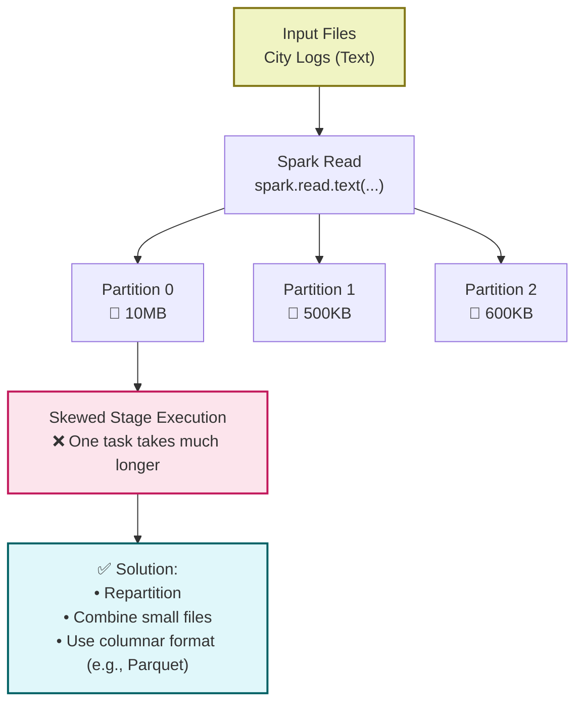


```bash
spark.conf.set("spark.sql.files.maxPartitionBytes", 256*1024*1024)  # 128–512MB common setting
spark.conf.set("spark.sql.files.openCostInBytes",   8*1024*1024)    # 8–16MB adjustable for small file sizes, 1M+8M = 9M
# 1000 1M small files
# 1000 / 256 = 4 tasks VS 1000 / (256/9) = 36 tasks can reduce file handles
spark.conf.set("spark.sql.orc.enableVectorizedReader","true")
spark.conf.set("spark.sql.orc.filterPushdown","true")
# AQE (valid for shuffles)
spark.conf.set("spark.sql.adaptive.enabled","true")
spark.conf.set("spark.sql.adaptive.coalescePartitions.enabled","true")
spark.conf.set("spark.sql.adaptive.skewJoin.enabled","true")
```

<details>
<summary>💬 **Solution:**</summary>

> SET spark.sql.shuffle.partitions = 20;     
> SET hive.exec.dynamic.partition.mode = nonstrict;

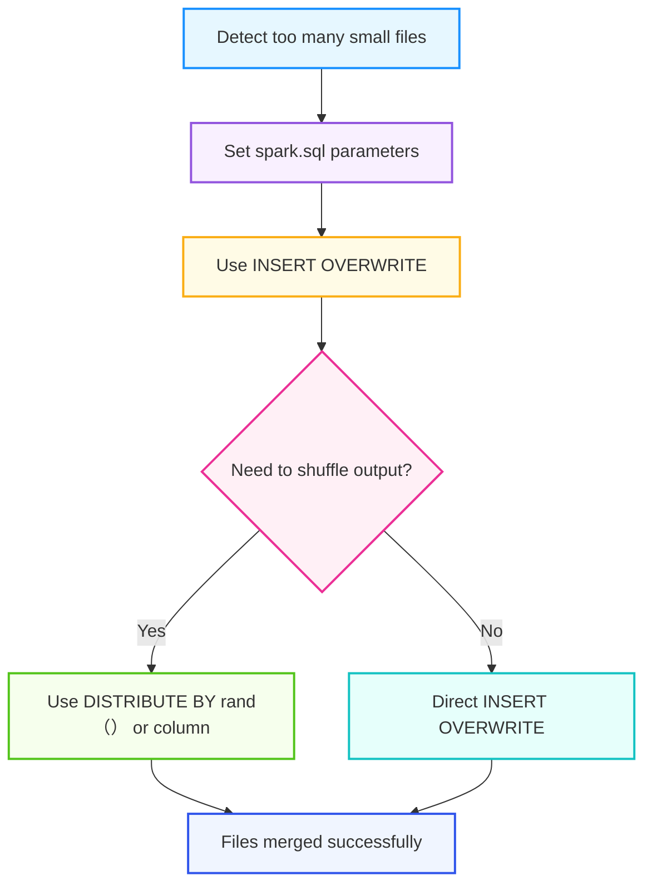

</details>

### 🟣 2. Skewed Join Keys

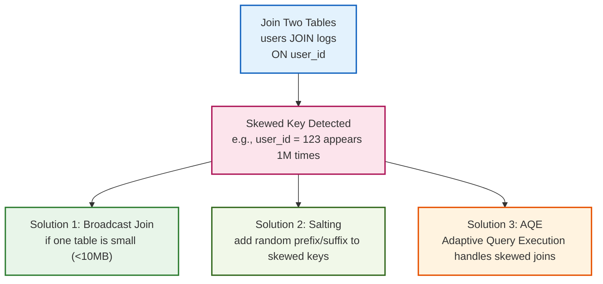

| Feature                  | AQE (Adaptive Query Execution)          | Salting                                          |
| ------------------------ | ----------------------------- | ----------------------------- |
| **Optimization timing**  | After shuffle (runtime) <br> **With AQE enabled**, spark.sql.shuffle.partitions is used only as an **<mark>initial value / upper bound</mark>** for the shuffle partitions. AQE will dynamically merge or split them at runtime.                | Before shuffle (logical rewrite)                 |
| **Implementation**       | Automatic (enable config)               | Manual (modify SQL/ETL)                          |
| **Skew type handled**    | Join/aggregation skew **after** shuffle <br> 1. AQE does not rewrite data to disk — it only modifies the scheduling metadata. <br> 2. The shuffle files remain exactly the ones written by the map stage. <br> 3. As a result, AQE’s overhead is minimal (it’s just analysis and re-planning), and there’s no need for a disk rewrite. | Join skew or data source skew **before** shuffle |
| **Intrusiveness**        | No SQL changes required                 | SQL changes required                             |
| **Best fit scenario**    | Skew is mild and/or not fixed           | Skewed key is known and severe                   |

How Spark chooses (Spark 3.3)
- Broadcast first: if one side fits autoBroadcastJoinThreshold → BHJ. (You can disable by setting to -1 or force via /*+ BROADCAST(t) */.) 
- Otherwise default = SMJ for equi-joins (because spark.sql.join.preferSortMergeJoin=true by default). 
- SHJ: considered when SMJ is not preferred (set spark.sql.join.preferSortMergeJoin=false, or hint /*+ SHUFFLE_HASH(t) */). Spark uses a per-partition hash map on the build side.

### 🟡 3. Skewed Aggregation Keys

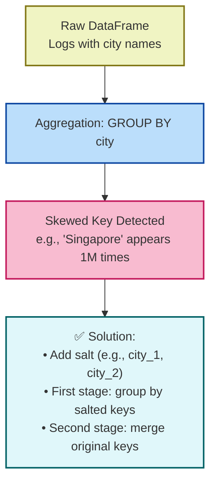

### 🔧 4. General Spark Tuning & SQL Optimization

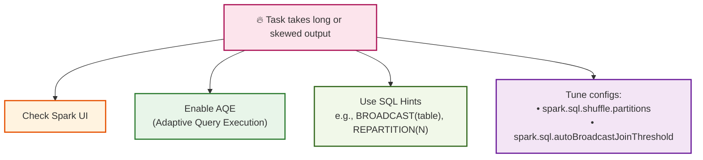

## ⚙️ 5. General Spark Tuning (Skew Indirectly Helpful)

These don't solve skew but improve performance or stability overall.
   
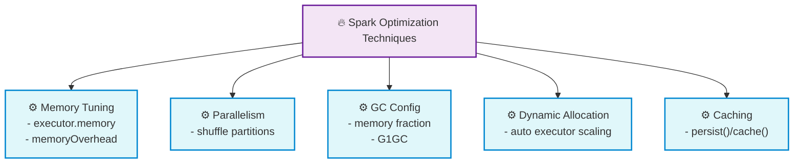

1. **Memory Configuration**
    - Adjust executor/driver memory
    - Configure memory overhead
2. **Parallelism Settings**
    - Tune `spark.sql.shuffle.partitions`
    - Adjust `spark.default.parallelism`
3. **GC Optimization**
    - Tune memory fraction
4. **Dynamic Resource Allocation**
    - Enable auto-scaling of executors
5. **Caching & Persistence**
    - Reuse intermediate results
  
## 6. ❓ Spark QA

---

<details>
<summary><strong>Q1: After Spark reads data, what determines the number of partitions, and what is the role of `spark.sql.shuffle.partitions`? Is setting it to 200 meaningful?</strong></summary>

- The initial partition count is determined by the data source (e.g., HDFS block size, file format, and parallelism).
- `spark.sql.shuffle.partitions` sets the number of partitions **after a shuffle** (e.g., joins, aggregations, groupBy), not during file read.
- Setting it to 200 can be helpful for **large datasets**, increasing parallelism; however, it might introduce overhead for small datasets.

```sql
-- Set partition count for shuffle
SET spark.sql.shuffle.partitions = 200;
```

#### 🔍 Detailed Explanation:

##### 1.1 Input Partitioning:
- Spark reads data based on HDFS block size or other input format configurations. This determines the **initial parallelism**.

##### 1.2 Read & Partition:
- After reading, data is split into partitions.
- More partitions = more parallel tasks = higher throughput (if cluster resources allow).

##### 1.3 Map Phase:
- Tasks transform data within their partition.
- No shuffle or inter-node communication occurs in this phase.

##### 1.4 Reduce Phase:
- Shuffle re-partitions data based on key, such as `groupBy`, `join`, etc.
- Number of reduce tasks is controlled by `spark.sql.shuffle.partitions`.

##### 1.5 Partitions ↔️ Tasks:
- One partition = One task.
- Parallelism depends on partition count **and** available cluster resources (e.g., executor cores).

</details>

<details>
<summary><strong>Q2: What's the difference between MapReduce and Spark in terms of shuffle and memory?</strong></summary>

- **Spark**: Supports in-memory computation and DAG execution.
- **MapReduce**: Always writes intermediate data to disk.

| Aspect  | Spark (Closest Feature)        | MapReduce (MR)   |
|---------------------|-----------------------------|----------------------------|
| **Execution Model** | **<mark>DAG of stages</mark>**; in-memory, **<mark>pipelined execution</mark>** | Two fixed stages: Map → Reduce; disk-based    |
| **Shuffle**         | Sort-based Shuffle with optimizations (AQE, push-based, bypass merge) | Always disk + full sort, heavy I/O            |
| **Intermediate Data** | Cached in memory (spill to disk only if needed) | Written to disk every stage                 |
| **Fault Tolerance** | RDD lineage recomputes only lost partitions  | Restart tasks using on-disk data

#### 🔹 (1) In-Memory Advantage:

- Spark can cache data in memory across stages, significantly reducing I/O overhead.
- MapReduce flushes to HDFS between each stage.

#### 🔹 (2) DAG Execution:

- Spark builds a Directed Acyclic Graph (DAG) of stages and tasks.
- Reduces unnecessary data writes by chaining operations intelligently.

<div align="center">
  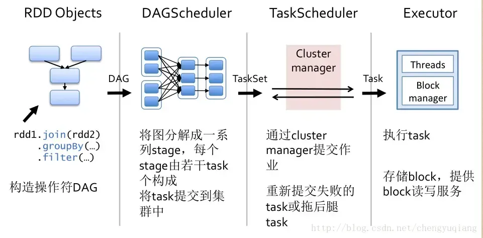
</div>

#### 🔹 (3) Spark Architecture:

- **Driver & SparkContext**: Starts app, builds DAG via RDD/DataFrame ops.
- **DAG Scheduler**: Splits stages, submits tasks.
- **Execution Engine**: Executes tasks on workers.

<div align="center">
  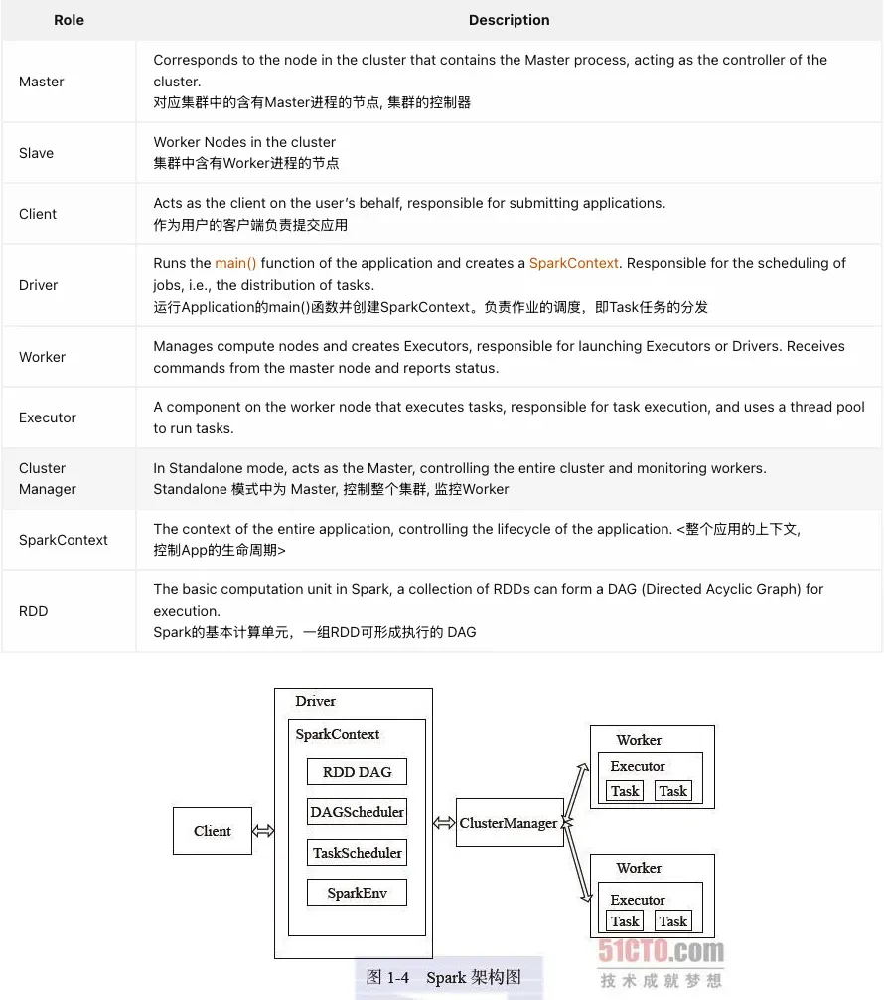
</div>

</details>

<details>
<summary><strong> Q3: Why is "Shuffle Read" the bottleneck in skewed aggregations?</strong></summary>

- Spark **reduce tasks** fetch partition files written by map tasks — this is the **Shuffle Read** stage.
- Under skew, some partitions are significantly larger → more data to read → **slower tasks**.
- Aggregation (CPU-bound) is usually lightweight vs I/O-heavy Shuffle Read.

#### 📊 Spark UI Indicators:

- **Shuffle Read Time**: High = skewed data fetch.
- **Task CPU Time**: Usually low even in skew cases.

</details>

<details>
<summary><strong>Q4: How do I troubleshoot Spark performance problems?</strong></summary>

| **Step** | **Description**  | **Key Focus** |
| --- | --- | --- |
| **1. Web UI** | Identify slow jobs and stages.  | Optimize resource allocation and adjust configurations. |
| **2. SQL Code & DAG Inspection** | Analyze long SQL queries and the corresponding DAG to pinpoint problematic parts  | Simplify query logic and optimize expensive operations. |
| **3. Examine Execution Plans** | Use EXPLAIN to view the logical, optimized logical, and physical plans. Focus on problematic nodes like **HashAggregate, SortAggregate, SortMergeJoin**, etc. | Identify problematic nodes and adjust join strategies or grouping techniques. |
| **4.** Web UI - **Stage Summary Metrics** | Analyze task metrics in the Spark Web UI (execution time, data processed) to detect data skew, slow tasks, or resource bottlenecks. | Identify data skew and resource bottlenecks by examining task-level metrics. |
| **5. Data Context Investigation** | Examine the underlying datasets (e.g., using GROUP BY and COUNT queries) to detect skewed keys or large columns that may cause performance issues. | Collaborate with teams to adjust the data model or partitioning strategy if necessary. |

💡 Also monitor:
- **Shuffle Read Time**: If it dominates, the issue is I/O, not CPU.
- **Task Duration Distribution**: Long tails often mean skew.
- **Spill Metrics**: Frequent spills imply memory pressure.

</details>

<details>
<summary><strong>Q5: What is Spark Catalyst Optimizer?</strong></summary>

**A:** Catalyst is the **query optimiser** in SparkSQL.

<div align="center">
  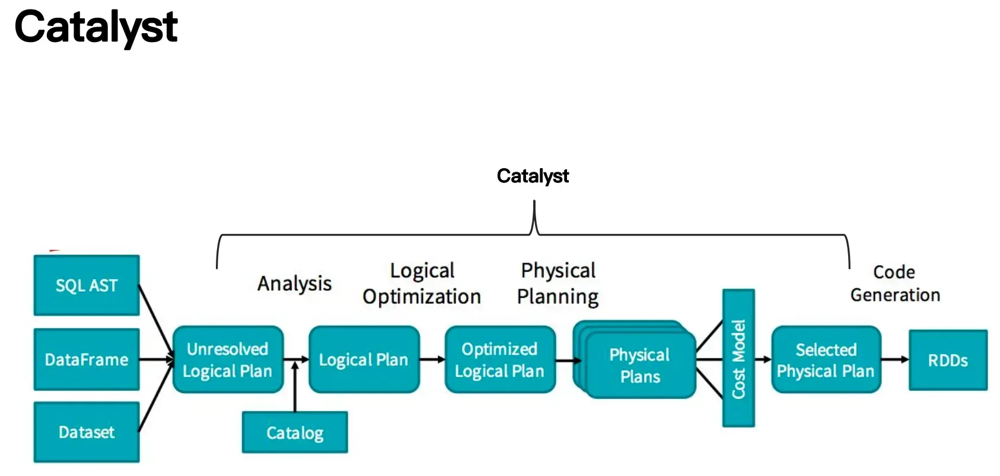
</div>

- Applies rule-based optimizations:
  - Predicate Pushdown
  - Constant Folding
  - Join Reordering
  - Column Pruning
- Generates efficient execution plans for better performance.

</details>


<details>
<summary><strong>Q6: How to use salting to resolve join skew in Spark?</strong></summary>

```sql
-- Spark SQL / Hive SQL
WITH saltedLarge AS (
  SELECT 
    CONCAT(CAST(FLOOR(RAND() * 10) AS STRING), '_', joinKey) AS saltedKey,
    someValue
  FROM largeTable
),

saltedSmall AS (
  WITH saltValues AS (
    SELECT '0' AS salt
    UNION ALL SELECT '1'
    UNION ALL SELECT '2'
    UNION ALL SELECT '3'
    UNION ALL SELECT '4'
    UNION ALL SELECT '5'
    UNION ALL SELECT '6'
    UNION ALL SELECT '7'
    UNION ALL SELECT '8'
    UNION ALL SELECT '9'
  )
  SELECT 
    CONCAT(sv.salt, '_', t.joinKey) AS saltedKey,
    otherValue
  FROM smallTable t
  CROSS JOIN saltValues sv
)  -- 

SELECT 
  split(s.saltedKey, '_')[1] AS originalKey,
  sum(s.someValue) AS aggregatedValue
FROM saltedLarge s
JOIN saltedSmall ss
  ON s.saltedKey = ss.saltedKey
GROUP BY split(s.saltedKey, '_')[1];
```

</details>
