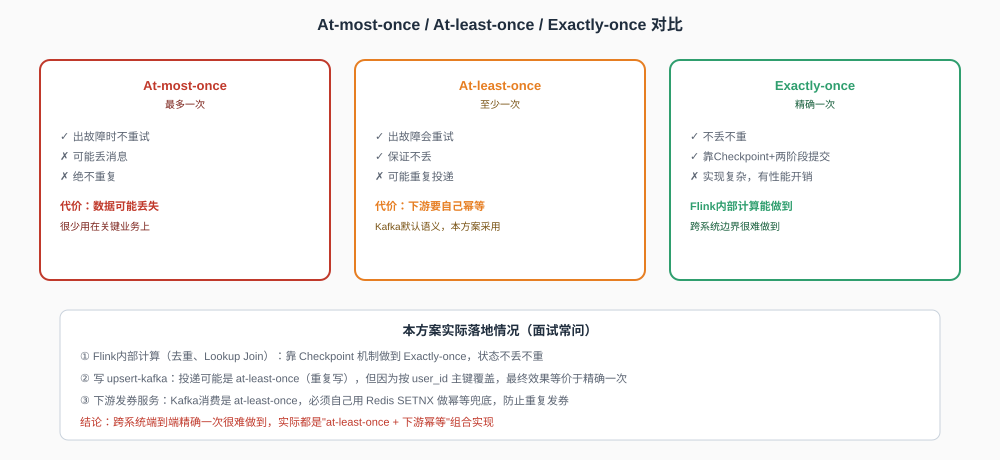
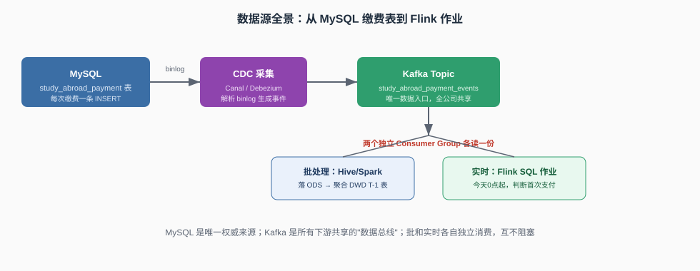
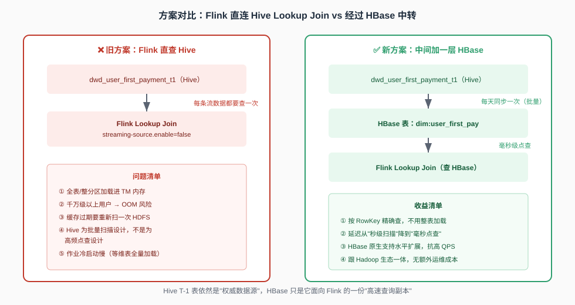
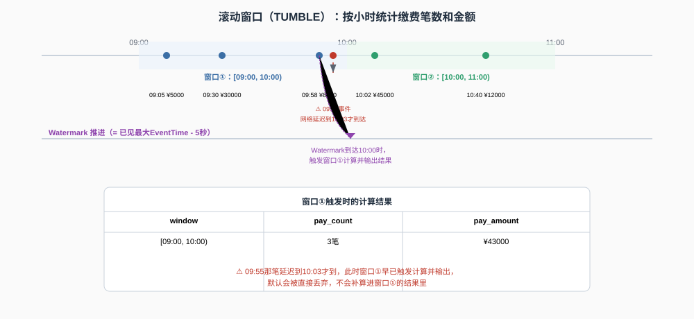
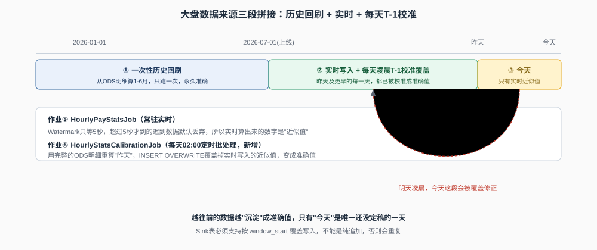
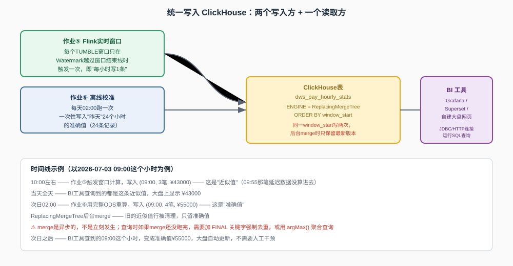

# Production-Oriented Flink SQL Design: Two End-to-End Cases

This guide presents two independent Flink data-engineering cases:

- **Case 1 — First-Payment Detection:** detect a user's first study-abroad payment and trigger a coupon.
- **Case 2 — Hourly Payment Dashboard:** calculate hourly payment metrics, backfill historical data, and perform daily T-1 reconciliation.

Both cases share the same foundations: naming conventions, time semantics, connectors, delivery guarantees, state recovery, and deployment practices.

---

## Table of Contents

- [1. Shared Foundations](#1-shared-foundations)
  - [1.1 Naming Conventions](#11-naming-conventions)
  - [1.2 Event Time, Processing Time, and Watermarks](#12-event-time-processing-time-and-watermarks)
  - [1.3 Connector Roles](#13-connector-roles)
  - [1.4 Delivery Semantics](#14-delivery-semantics)
  - [1.5 Checkpoints, Savepoints, and Recovery](#15-checkpoints-savepoints-and-recovery)
- [2. Case 1 — First-Payment Detection](#2-case-1--first-payment-detection)
  - [2.1 Business Requirement](#21-business-requirement)
  - [2.2 End-to-End Architecture](#22-end-to-end-architecture)
  - [2.3 Source Table](#23-source-table)
  - [2.4 Historical First-Payment Dimension](#24-historical-first-payment-dimension)
  - [2.5 HBase Lookup Layer](#25-hbase-lookup-layer)
  - [2.6 Single Flink Job](#26-single-flink-job)
  - [2.7 Downstream Idempotency](#27-downstream-idempotency)
- [3. Case 2 — Hourly Payment Dashboard](#3-case-2--hourly-payment-dashboard)
  - [3.1 Business Requirement](#31-business-requirement)
  - [3.2 Event-Time Window Aggregation](#32-event-time-window-aggregation)
  - [3.3 Watermark Behaviour](#33-watermark-behaviour)
  - [3.4 Historical Backfill](#34-historical-backfill)
  - [3.5 Daily T-1 Reconciliation](#35-daily-t-1-reconciliation)
  - [3.6 ClickHouse Serving Layer](#36-clickhouse-serving-layer)
- [4. Job Inventory and Deployment](#4-job-inventory-and-deployment)
- [5. Interview Quick Reference](#5-interview-quick-reference)

---

# 1. Shared Foundations

## 1.1 Naming Conventions

| Pattern | Object Type | Purpose | Example |
|---|---|---|---|
| `dm_` | Hive data-mart table | Curated business-level dataset and authoritative batch result | `dm_user_first_payment_d` |
| `hbt_dm_` | HBase physical table | Low-latency serving copy of a Hive data-mart table | `hbt_dm_user_first_payment_d` |
| `ft_src_` | Flink source table | Connector mapping used to read external data | `ft_src_payment_events` |
| `ft_dim_` | Flink lookup table | Connector mapping used for dimension lookup | `ft_dim_hbase_first_pay` |
| `ft_sink_` | Flink sink table | Connector mapping used to write output data | `ft_sink_coupon_trigger` |
| `_d` | Daily snapshot suffix | Full daily snapshot, usually overwritten by partition | `dm_user_first_payment_d` |

> A Flink SQL table is normally a connector definition. It does not store data by itself.

---

## 1.2 Event Time, Processing Time, and Watermarks


### Event Time

**Event time** is the business timestamp carried by the record, such as `pay_time`. It is independent of when Flink processes the record.

### Processing Time

**Processing time** is the system clock time at which Flink processes a record:

```sql
proctime AS PROCTIME()
```

Processing time is useful for lookup joins because the lookup should use the dimension data visible when the event is processed.

### Comparison

| Property | Event Time | Processing Time |
|---|---|---|
| Source | Timestamp in the event | Flink system clock |
| Replay behaviour | Deterministic | Not deterministic |
| Typical use | Window aggregation | Temporal lookup join |

### Watermark

A watermark represents Flink's estimate that events earlier than a certain event-time position are unlikely to arrive.

```sql
WATERMARK FOR pay_time AS pay_time - INTERVAL '5' SECOND
```

This definition allows five seconds of out-of-order arrival:

```text
Current watermark = maximum observed event time - 5 seconds
```

---

## 1.3 Connector Roles

| Connector | Source | Sink | Lookup | Typical Use |
|---|:---:|:---:|:---:|---|
| Kafka | ✅ | ✅ | ❌ | Append event streams |
| Upsert Kafka | ✅ | ✅ | ❌ | Changelog streams keyed by a primary key |
| HBase | ✅ | ✅ | ✅ | High-frequency key-based lookup |
| JDBC | ✅ | ✅ | ✅ | Relational databases |
| Hive | ✅ | ✅ | ✅ | Batch tables and warehouse integration |
| Filesystem | ✅ | ✅ | ❌ | CSV, Parquet, and ORC on HDFS or S3 |
| Elasticsearch | ❌ | ✅ | ❌ | Search-oriented sink |
| ClickHouse | ⚠️ | ⚠️ | ⚠️ | Analytical serving through JDBC or a community connector |
| Print / Blackhole / DataGen | Partial | ✅ | ❌ | Testing and debugging |

### Redis

Apache Flink does not provide a first-class Redis connector for the Table/SQL API. Redis integration is usually implemented with a third-party connector or a custom asynchronous function in the DataStream API.

### ClickHouse

ClickHouse can be integrated through:

1. the generic Flink JDBC connector with the ClickHouse JDBC driver; or
2. a community ClickHouse connector with optimised batching and asynchronous writes.

ClickHouse integration is generally more mature than Redis integration for analytical workloads.

---

## 1.4 Delivery Semantics



| Semantic | Behaviour | Operational Impact |
|---|---|---|
| At-most-once | A record may be lost but is never retried | Rarely suitable for critical data |
| At-least-once | A record is retried and may be duplicated | The sink or business service must be idempotent |
| Exactly-once | No loss and no duplicate effect within the guaranteed boundary | More complex, especially across external systems |

Flink uses checkpoints and aligned barriers to provide exactly-once state recovery inside the Flink job.

However, an end-to-end flow can still behave as:

```text
At-least-once delivery + idempotent downstream processing
```

Examples of idempotent handling include:

- upsert by primary key;
- deterministic record identifiers;
- Redis `SETNX`;
- transactional or idempotent sinks.

---

## 1.5 Checkpoints, Savepoints, and Recovery

A long-running streaming job should enable checkpoints:

```sql
SET 'execution.checkpointing.interval' = '60 s';
SET 'execution.checkpointing.mode' = 'EXACTLY_ONCE';
SET 'state.checkpoints.dir' = 'hdfs:///flink-checkpoints/first-pay';
SET 'execution.checkpointing.min-pause' = '30 s';
SET 'execution.checkpointing.timeout' = '10 min';
```

| Scenario | Data-Loss Risk | Recommended Action |
|---|---|---|
| Automatic restart with checkpoints | Low | Flink restores from the latest successful checkpoint |
| Planned restart with a savepoint | Low | Stop with a savepoint and restart from it |
| Unplanned manual restart without state | High | Avoid unless replay behaviour is fully understood |

Recommended planned restart:

```bash
flink stop --savepointPath hdfs:///savepoints/first-pay <job_id>
flink run -s hdfs:///savepoints/first-pay -d first_pay_job.sql
```

Without a savepoint or checkpoint, recovery falls back to Kafka offsets. If no committed offset exists, `auto.offset.reset` determines whether the job starts from `latest` or `earliest`, which may cause data loss or large-scale replay.

---

# 2. Case 1 — First-Payment Detection

## 2.1 Business Requirement

Detect whether a user has made their first-ever study-abroad payment. When a genuine first payment is identified, publish a coupon-trigger event immediately.

The real-time path is intentionally implemented as **one Flink job**:

```text
Kafka payment event
→ deduplicate the user's first payment of the day
→ look up historical first-payment data in HBase
→ keep genuine first-time users
→ publish coupon-trigger event
```

This design avoids an unnecessary intermediate Kafka topic while keeping the business flow easy to understand.

---

## 2.2 End-to-End Architecture



```text
MySQL study_abroad_payment
        │
        │ CDC through Canal or Debezium
        ▼
Kafka: study_abroad_payment_events
        │
        ▼
Single Flink SQL Job
  1. Daily first-payment deduplication
  2. HBase temporal lookup
  3. Genuine first-payment filtering
        │
        ▼
Kafka: first_pay_coupon_trigger
        │
        ▼
Coupon Service
  Redis SETNX idempotency guard
```

The historical serving path is:

```text
Hive authoritative snapshot
→ scheduled Spark/Hive merge
→ scheduled HBase bulk load
→ Flink temporal lookup
```

---

## 2.3 Source Table

Example MySQL records:

| order_id | user_id | pay_time | pay_amount | pay_type |
|---|---|---|---:|---|
| order_88213 | u_7001 | 2026-07-03 09:00:00 | 5000.00 | Deposit |
| order_88214 | u_7001 | 2026-07-03 15:30:00 | 45000.00 | Final payment |
| order_91002 | u_8002 | 2026-07-03 10:00:00 | 30000.00 | Full payment |

The CDC layer reads the MySQL binlog and publishes JSON events to Kafka without changing the business application.

```sql
CREATE TABLE ft_src_payment_events (
    order_id    STRING,
    user_id     STRING,
    pay_time    TIMESTAMP(3),
    pay_amount  DECIMAL(10, 2),
    proctime    AS PROCTIME(),
    WATERMARK FOR pay_time AS pay_time - INTERVAL '5' SECOND
) WITH (
    'connector' = 'kafka',
    'topic' = 'study_abroad_payment_events',
    'properties.bootstrap.servers' = 'broker:9092',
    'properties.group.id' = 'first-pay-job-group',
    'properties.auto.offset.reset' = 'latest',
    'format' = 'json',
    'scan.startup.mode' = 'group-offsets'
);
```

---

## 2.4 Historical First-Payment Dimension

The Hive table is the authoritative batch dataset:

```text
dm.dm_user_first_payment_d
```

| user_id | first_pay_time | first_order_id | dt |
|---|---|---|---|
| u_8002 | 2025-11-03 07:20:00 | order_31005 | 2026-07-02 |

A scheduled job merges the previous snapshot with newly discovered first-payment users:

```sql
INSERT OVERWRITE TABLE dm.dm_user_first_payment_d
PARTITION (dt = '${yesterday}')
SELECT
    COALESCE(old.user_id, new.user_id) AS user_id,
    LEAST(
        COALESCE(old.first_pay_time, new.first_pay_time),
        COALESCE(new.first_pay_time, old.first_pay_time)
    ) AS first_pay_time,
    CASE
        WHEN old.first_pay_time IS NULL THEN new.first_order_id
        WHEN new.first_pay_time IS NULL THEN old.first_order_id
        WHEN old.first_pay_time <= new.first_pay_time THEN old.first_order_id
        ELSE new.first_order_id
    END AS first_order_id
FROM dm.dm_user_first_payment_d old
FULL OUTER JOIN today_new_users_snapshot new
    ON old.user_id = new.user_id;
```

---

## 2.5 HBase Lookup Layer



| Capability | Hive | HBase |
|---|---|---|
| Primary purpose | Batch scanning and analytics | Low-latency random lookup |
| Lookup-join behaviour | Expensive for high-frequency key lookup | Direct access by row key |
| Best use in this case | Authoritative batch snapshot | Online lookup dimension |

HBase table definition:

```bash
create 'hbt_dm_user_first_payment_d',
{
    NAME => 'cf',
    DATA_BLOCK_ENCODING => 'FAST_DIFF',
    BLOOMFILTER => 'ROW',
    REPLICATION_SCOPE => '0',
    VERSIONS => '1',
    MIN_VERSIONS => '0',
    KEEP_DELETED_CELLS => 'false',
    COMPRESSION => 'SNAPPY'
}
```

Recommended row key:

```text
MD5(user_id).substring(0, 2) + "_" + user_id
```

The hash prefix distributes writes across HBase regions and reduces hotspot risk.

For a large daily refresh, Spark generates HFiles and uses HBase bulk load instead of issuing one `Put` operation per row:

```scala
val df = spark.sql(
  "SELECT user_id, first_pay_time, first_order_id " +
  "FROM dm.dm_user_first_payment_d"
)

val rdd = df.rdd.map { row =>
  val userId = row.getAs[String]("user_id")
  (s"${md5Prefix(userId)}_${userId}", row)
}.sortByKey()

rdd.saveAsNewAPIHadoopFile(
  "/tmp/hbase_bulkload/hbt_dm_user_first_payment_d",
  ...
)
```

---

## 2.6 Single Flink Job

### HBase Lookup Table

```sql
CREATE TABLE ft_dim_hbase_first_pay (
    rowkey STRING,
    cf ROW<
        first_pay_time STRING,
        first_order_id STRING
    >,
    PRIMARY KEY (rowkey) NOT ENFORCED
) WITH (
    'connector' = 'hbase-2.2',
    'table-name' = 'hbt_dm_user_first_payment_d',
    'zookeeper.quorum' = 'zk1:2181,zk2:2181,zk3:2181',
    'lookup.cache.max-rows' = '500000',
    'lookup.cache.ttl' = '30 min'
);
```

### Coupon-Trigger Sink

```sql
CREATE TABLE ft_sink_coupon_trigger (
    user_id  STRING,
    order_id STRING,
    pay_time TIMESTAMP(3),
    PRIMARY KEY (user_id) NOT ENFORCED
) WITH (
    'connector' = 'upsert-kafka',
    'topic' = 'first_pay_coupon_trigger',
    'key.format' = 'json',
    'value.format' = 'json'
);
```

### Daily Deduplication and HBase Lookup

```sql
CREATE TEMPORARY VIEW first_payment_of_day AS
SELECT
    user_id,
    order_id,
    pay_time,
    proctime
FROM (
    SELECT
        user_id,
        order_id,
        pay_time,
        proctime,
        ROW_NUMBER() OVER (
            PARTITION BY
                user_id,
                DATE_FORMAT(pay_time, 'yyyy-MM-dd')
            ORDER BY pay_time ASC
        ) AS rn
    FROM ft_src_payment_events
)
WHERE rn = 1;
```

The date is included in the partition key because the streaming job runs continuously across multiple days. Without the date, Flink would retain the user's earliest record across the entire job lifetime rather than the earliest record for the current day.

State should be bounded with an appropriate TTL:

```sql
SET 'table.exec.state.ttl' = '25 h';
```

The final lookup and filter are performed in the same job:

```sql
INSERT INTO ft_sink_coupon_trigger
SELECT
    t.user_id,
    t.order_id,
    t.pay_time
FROM first_payment_of_day AS t
LEFT JOIN ft_dim_hbase_first_pay
    FOR SYSTEM_TIME AS OF t.proctime AS h
    ON CONCAT(md5_prefix(t.user_id), '_', t.user_id) = h.rowkey
WHERE h.rowkey IS NULL;
```

Interpretation:

- `ROW_NUMBER()` keeps the earliest payment for each user and business date.
- `FOR SYSTEM_TIME AS OF t.proctime` performs a processing-time temporal lookup.
- `h.rowkey IS NULL` means the user does not exist in the historical first-payment dimension.
- Only genuine first-time users are written to the coupon-trigger topic.

> `md5_prefix()` represents a registered scalar function that returns the same two-character hash prefix used by the HBase row-key design.

---

## 2.7 Downstream Idempotency

Kafka delivery may be at-least-once, so the coupon service must prevent duplicate coupon issuance:

```text
SETNX coupon:u_7001:activity_2026Q3
```

Recommended behaviour:

```text
Key does not exist → create key and issue coupon
Key already exists → skip duplicate request
```

The idempotency key should include both the user and the campaign identifier. Its expiration period should follow the business validity period rather than using an arbitrary fixed value.

---

# 3. Case 2 — Hourly Payment Dashboard

## 3.1 Business Requirement

Operations users need an hourly dashboard showing:

- payment count;
- total payment amount.

The solution must also handle:

- events that arrive out of order;
- historical data from before the streaming job was deployed;
- late events that were not included in the real-time result;
- a stable analytical table for BI tools.



---

## 3.2 Event-Time Window Aggregation

Example events:

| user_id | pay_time | pay_amount | Arrival Time |
|---|---|---:|---|
| u_7001 | 09:05:00 | 5000 | 09:05:02 |
| u_8002 | 09:30:00 | 30000 | 09:30:01 |
| u_9003 | 09:58:00 | 8000 | 09:58:03 |
| u_9003 | **09:55:00** | 12000 | **10:03:00** |
| u_7001 | 10:02:00 | 45000 | 10:02:01 |

### Source

```sql
CREATE TABLE ft_src_payment_events_stats (
    order_id    STRING,
    user_id     STRING,
    pay_time    TIMESTAMP(3),
    pay_amount  DECIMAL(10, 2),
    WATERMARK FOR pay_time AS pay_time - INTERVAL '5' SECOND
) WITH (
    'connector' = 'kafka',
    'topic' = 'study_abroad_payment_events',
    'properties.bootstrap.servers' = 'broker:9092',
    'properties.group.id' = 'hourly-stats-job-group',
    'properties.auto.offset.reset' = 'latest',
    'format' = 'json',
    'scan.startup.mode' = 'group-offsets',
    'scan.watermark.idle-timeout' = '1 min'
);
```

### Hourly Aggregation

```sql
INSERT INTO ft_sink_pay_hourly_stats
SELECT
    window_start,
    window_end,
    COUNT(*)       AS pay_count,
    SUM(pay_amount) AS pay_amount
FROM TABLE(
    TUMBLE(
        TABLE ft_src_payment_events_stats,
        DESCRIPTOR(pay_time),
        INTERVAL '1' HOUR
    )
)
GROUP BY window_start, window_end;
```

`DESCRIPTOR(pay_time)` tells Flink to assign records to windows using the event-time column.

Logical window assignment:

| order_id | pay_time | pay_amount | window_start | window_end |
|---|---|---:|---|---|
| O1 | 10:05 | 100 | 10:00 | 11:00 |
| O2 | 10:20 | 200 | 10:00 | 11:00 |
| O3 | 10:55 | 50 | 10:00 | 11:00 |
| O4 | 11:10 | 300 | 11:00 | 12:00 |

---

## 3.3 Watermark Behaviour

For the `[09:00, 10:00)` window:

```text
09:05:02  event time 09:05:00 → watermark 09:04:55
09:58:03  event time 09:58:00 → watermark 09:57:55
10:02:01  event time 10:02:00 → watermark 10:01:55
```

When the watermark passes `10:00:00`, Flink closes the window and emits the result.

The event with event time `09:55:00` arriving at `10:03:00` is later than the current watermark and is therefore late for the already-closed window.

### Important Clarification

A watermark does not advance because the wall clock reaches a certain time. It advances when source records arrive and Flink observes newer event timestamps.

If a Kafka partition becomes idle, it can prevent the combined watermark from advancing. The idle-source setting avoids that problem:

```sql
'scan.watermark.idle-timeout' = '1 min'
```

A late event does not always have to be discarded. Depending on the API and sink semantics, a design may use allowed lateness, updates, or a side output. This case deliberately uses daily T-1 reconciliation as the accuracy mechanism.

---

## 3.4 Historical Backfill

A streaming job deployed on 2026-07-01 cannot automatically calculate January-to-June history. Historical data should be processed once from the complete ODS table.



```sql
INSERT OVERWRITE TABLE dm.dm_pay_hourly_stats_d PARTITION (dt)
SELECT
    DATE_FORMAT(pay_time, 'yyyy-MM-dd') AS dt,
    DATE_FORMAT(pay_time, 'yyyy-MM-dd HH:00:00') AS window_start,
    COUNT(*) AS pay_count,
    SUM(pay_amount) AS pay_amount
FROM ods.ods_payment_detail
WHERE dt >= '2026-01-01'
  AND dt <  '2026-07-01'
GROUP BY
    DATE_FORMAT(pay_time, 'yyyy-MM-dd'),
    DATE_FORMAT(pay_time, 'yyyy-MM-dd HH:00:00');
```

This is a one-time backfill job. It is not scheduled after the historical range has been loaded.

---

## 3.5 Daily T-1 Reconciliation

The real-time result for the current day is low-latency but may exclude very late events. A scheduled batch job recalculates the previous day from the complete ODS table:

```sql
INSERT OVERWRITE TABLE dm.dm_pay_hourly_stats_d
PARTITION (dt = '${yesterday}')
SELECT
    DATE_FORMAT(pay_time, 'yyyy-MM-dd HH:00:00') AS window_start,
    COUNT(*) AS pay_count,
    SUM(pay_amount) AS pay_amount
FROM ods.ods_payment_detail
WHERE dt = '${yesterday}'
GROUP BY DATE_FORMAT(pay_time, 'yyyy-MM-dd HH:00:00');
```

Accuracy model:

```text
Historical period before go-live
→ one-time backfill
→ final and stable

Yesterday and earlier after go-live
→ real-time result
→ replaced by T-1 batch result
→ final and stable

Today
→ current real-time approximation
→ reconciled tomorrow
```

---

## 3.6 ClickHouse Serving Layer



### Why ClickHouse

| Requirement | HBase | ClickHouse |
|---|---|---|
| Main reader | Application performing key lookup | BI tool or analyst |
| Query pattern | High-frequency lookup by `user_id` | Time-range aggregation |
| Best capability | Millisecond key access | Analytical filtering and aggregation |

HBase serves Case 1's online lookup. ClickHouse serves Case 2's analytical dashboard.

### Table Definition

```sql
CREATE TABLE dws_pay_hourly_stats
(
    window_start DateTime,
    pay_count    UInt64,
    pay_amount   Decimal(18, 2),
    update_time  DateTime DEFAULT now()
)
ENGINE = ReplacingMergeTree(update_time)
ORDER BY window_start;
```

`ReplacingMergeTree` accepts repeated versions of the same `window_start` and retains the latest version during background merges.

Because merges are asynchronous, BI queries should explicitly select the latest version:

```sql
SELECT
    window_start,
    argMax(pay_count, update_time)  AS pay_count,
    argMax(pay_amount, update_time) AS pay_amount
FROM dws_pay_hourly_stats
GROUP BY window_start
ORDER BY window_start;
```

### Real-Time Write

The Flink job writes one result when each hourly window closes:

```sql
CREATE TABLE ft_sink_pay_hourly_stats (
    window_start TIMESTAMP(3),
    window_end   TIMESTAMP(3),
    pay_count    BIGINT,
    pay_amount   DECIMAL(18, 2)
) WITH (
    'connector' = 'clickhouse',
    'url' = 'clickhouse://ch-server:8123',
    'database' = 'default',
    'table-name' = 'dws_pay_hourly_stats',
    'sink.batch-size' = '1'
);
```

### T-1 Corrective Write

The batch job writes the corrected hourly rows for yesterday with a newer `update_time`:

```sql
INSERT INTO dws_pay_hourly_stats
SELECT
    DATE_FORMAT(pay_time, 'yyyy-MM-dd HH:00:00') AS window_start,
    COUNT(*) AS pay_count,
    SUM(pay_amount) AS pay_amount,
    NOW() AS update_time
FROM ods.ods_payment_detail
WHERE dt = '${yesterday}'
GROUP BY DATE_FORMAT(pay_time, 'yyyy-MM-dd HH:00:00');
```

### BI Access

Grafana, Superset, or another BI application connects directly to ClickHouse through JDBC or HTTP. The BI layer does not need to know whether a row came from Flink, historical backfill, or T-1 reconciliation.

---

# 4. Job Inventory and Deployment

| Job | Case | Technology | Mode | Purpose |
|---|---|---|---|---|
| FirstPayDetectionJob | Case 1 | Flink SQL | Long-running, P0 | Deduplicate, look up HBase, and trigger coupons |
| HiveFirstPayMergeJob | Case 1 | Hive/Spark SQL | Daily at 02:00 | Maintain authoritative first-payment snapshot |
| BulkLoadHBaseJob | Case 1 | Spark + HBase | Daily at 02:30 | Refresh the online HBase lookup table |
| HourlyPayStatsJob | Case 2 | Flink SQL | Long-running, P2 | Produce hourly real-time metrics |
| HourlyStatsBackfillJob | Case 2 | Hive/Spark SQL | One-time | Load pre-deployment history |
| HourlyStatsReconciliationJob | Case 2 | Hive/Spark SQL | Daily at 02:00 | Correct yesterday's hourly metrics |

### Deployment Model

| Job Type | Deployment | Normal Operation |
|---|---|---|
| Long-running Flink job | Submit once with checkpointing enabled | Automatically restarts after recoverable failures |
| Scheduled batch job | Register in Airflow or DolphinScheduler | Scheduler handles dependencies, retries, and alerts |
| One-time backfill | Execute manually with a fixed date range | Validate output and archive the run record |

---

# 5. Interview Quick Reference

| Question | Concise Answer |
|---|---|
| What is the difference between event time and processing time? | Event time comes from the business event and is replayable; processing time comes from the runtime system clock. |
| What does a watermark do? | It estimates event-time progress and determines when event-time windows can close. |
| Why is Case 1 implemented as one Flink job? | The deduplication and HBase lookup form one business transaction path, and no reusable intermediate stream is required. |
| Why include the date in the deduplication key? | A continuously running job spans multiple days; the date keeps each day's earliest payment independent. |
| Why is state TTL required? | It bounds retained state and removes obsolete daily keys. |
| Why use HBase instead of Hive for the lookup? | HBase supports low-latency key lookup, while Hive is designed mainly for batch scans. |
| Why salt the HBase row key? | The hash prefix distributes writes and reduces region hotspot risk. |
| Why use bulk load? | Bulk load creates HFiles and bypasses the normal per-row write path, which is more efficient for large refreshes. |
| Why does the coupon service still need idempotency? | Kafka delivery or job recovery may produce duplicate attempts, so the business action must be protected. |
| When does a tumbling window emit? | It emits when the watermark passes the window end, not simply when the wall clock reaches the hour. |
| What happens when a Kafka partition is idle? | Without idle-source detection, it can hold back the global watermark. |
| How is pre-deployment history loaded? | A one-time batch backfill calculates the historical period from the complete ODS table. |
| How are late-event inaccuracies corrected? | A daily T-1 batch job recalculates yesterday from complete offline data. |
| Why use ClickHouse instead of HBase for Case 2? | ClickHouse is designed for analytical aggregation and BI queries, while HBase is optimised for key-based lookup. |
| How does `ReplacingMergeTree` deduplicate? | It keeps the latest version during asynchronous merges; queries can use `argMax` or `FINAL` before merging completes. |
| How does BI access the data? | BI connects directly to ClickHouse through JDBC or HTTP and queries the latest logical version of each hourly result. |
