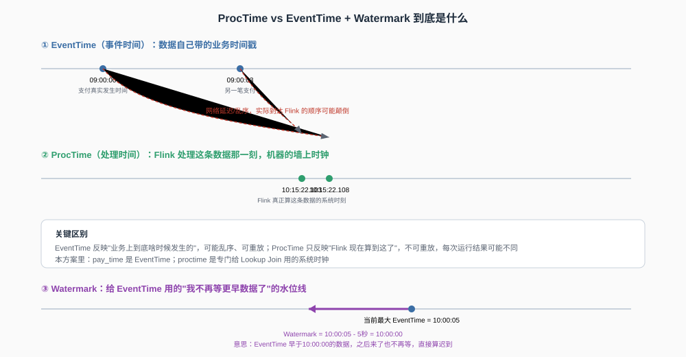

# **Flink Data Engineering Design: Two End-to-End Cases**

This guide explains two production-oriented **Flink SQL** solutions from the **macro architecture** to the **implementation details**.

- **Case 1 — First-Payment Detection:** Identify a user's first study-abroad payment and trigger a coupon.
- **Case 2 — Hourly Payment Dashboard:** Calculate hourly payment metrics, backfill historical data, and reconcile **T-1** results.

The document follows this sequence:

```text
Business Requirement
→ Solution Overview
→ End-to-End Flow
→ Core SQL
→ Table Definitions
→ Detailed Logic
→ Reliability and Operations
```

---

## **Table of Contents**

- [**1. Shared Foundations**](#1-shared-foundations)
  - [**1.1 Naming Conventions**](#11-naming-conventions)
  - [**1.2 Event Time, Processing Time, and Watermarks**](#12-event-time-processing-time-and-watermarks)
  - [**1.3 Connector Roles**](#13-connector-roles)
  - [**1.4 Delivery Semantics and Recovery**](#14-delivery-semantics-and-recovery)

- [**2. Case 1 — First-Payment Detection**](#2-case-1--first-payment-detection)
  - [**2.1 Business Requirement**](#21-business-requirement)
  - [**2.2 Solution Overview**](#22-solution-overview)
  - [**2.3 End-to-End Flow**](#23-end-to-end-flow)
  - [**2.4 Core Flink SQL**](#24-core-flink-sql)
  - [**2.5 Flink Table Definitions**](#25-flink-table-definitions)
    - [**2.5.1 Kafka Source — `ft_src_payment_events`**](#251-kafka-source--ft_src_payment_events)
    - [**2.5.2 HBase Lookup Table — `ft_dim_hbase_first_pay`**](#252-hbase-lookup-table--ft_dim_hbase_first_pay)
    - [**2.5.3 Kafka Sink — `ft_sink_coupon_trigger`**](#253-kafka-sink--ft_sink_coupon_trigger)
  - [**2.6 SQL Logic Explained**](#26-sql-logic-explained)
    - [**2.6.1 Daily Deduplication**](#261-daily-deduplication)
    - [**2.6.2 HBase Temporal Lookup**](#262-hbase-temporal-lookup)
    - [**2.6.3 First-Time User Filtering**](#263-first-time-user-filtering)
  - [**2.7 Historical Dimension Pipeline**](#27-historical-dimension-pipeline)
  - [**2.8 State and Reliability**](#28-state-and-reliability)
  - [**2.9 Downstream Idempotency**](#29-downstream-idempotency)

- [**3. Case 2 — Hourly Payment Dashboard**](#3-case-2--hourly-payment-dashboard)
  - [**3.1 Business Requirement**](#31-business-requirement)
  - [**3.2 Solution Overview**](#32-solution-overview)
  - [**3.3 End-to-End Flow**](#33-end-to-end-flow)
  - [**3.4 Core Flink SQL**](#34-core-flink-sql)
  - [**3.5 Watermark Behaviour**](#35-watermark-behaviour)
  - [**3.6 Historical Backfill**](#36-historical-backfill)
  - [**3.7 Daily T-1 Reconciliation**](#37-daily-t-1-reconciliation)
  - [**3.8 ClickHouse Serving Layer**](#38-clickhouse-serving-layer)

- [**4. Job Inventory and Deployment**](#4-job-inventory-and-deployment)
- [**5. Interview Quick Reference**](#5-interview-quick-reference)

---

# **1. Shared Foundations**

## **1.1 Naming Conventions**

| **Pattern** | **Meaning** | **Example** |
|---|---|---|
| `dm_` | **Hive data-mart table** | `dm_user_first_payment_d` |
| `hbt_dm_` | **HBase serving table** copied from Hive | `hbt_dm_user_first_payment_d` |
| `ft_src_` | **Flink source table** | `ft_src_payment_events` |
| `ft_dim_` | **Flink lookup or dimension table** | `ft_dim_hbase_first_pay` |
| `ft_sink_` | **Flink sink table** | `ft_sink_coupon_trigger` |
| `_d` | **Daily snapshot suffix** | `dm_user_first_payment_d` |

> A **Flink SQL table** is normally a **connector definition**. It maps Flink SQL to an external system and does not store data by itself.

---

## **1.2 Event Time, Processing Time, and Watermarks**



| **Concept** | **Meaning** | **Typical Use** |
|---|---|---|
| **Event Time** | Business time carried by the event, such as `pay_time` | Window aggregation |
| **Processing Time** | Flink system time when the record is processed | Temporal lookup join |
| **Watermark** | Estimated progress of event time | Closing event-time windows |

```sql
-- Processing-time attribute used by the HBase temporal lookup join.
proctime AS PROCTIME(),

-- Allow payment events to arrive up to five seconds out of order.
WATERMARK FOR pay_time
AS pay_time - INTERVAL '5' SECOND
```

```text
Watermark = Maximum observed event time - Allowed out-of-order delay
```

---

## **1.3 Connector Roles**

| **Connector** | **Source** | **Sink** | **Lookup** | **Main Use** |
|---|:---:|:---:|:---:|---|
| **Kafka** | ✅ | ✅ | ❌ | Append event streams |
| **Upsert Kafka** | ✅ | ✅ | ❌ | Keyed changelog streams |
| **HBase** | ✅ | ✅ | ✅ | Low-latency key lookup |
| **JDBC** | ✅ | ✅ | ✅ | Relational databases |
| **Hive** | ✅ | ✅ | ✅ | Batch tables and warehouse integration |
| **Filesystem** | ✅ | ✅ | ❌ | CSV, Parquet, and ORC |
| **ClickHouse** | ⚠️ | ⚠️ | ⚠️ | Analytical serving through JDBC or a community connector |

---

## **1.4 Delivery Semantics and Recovery**

| **Semantic** | **Behaviour** |
|---|---|
| **At-most-once** | May lose records but does not retry |
| **At-least-once** | Does not lose records but may produce duplicates |
| **Exactly-once** | Prevents duplicate effects within the guaranteed boundary |

```sql
-- Create a checkpoint every 60 seconds.
SET 'execution.checkpointing.interval' = '60 s';

-- Use exactly-once state consistency inside Flink.
SET 'execution.checkpointing.mode' = 'EXACTLY_ONCE';

-- Store checkpoint data in HDFS.
SET 'state.checkpoints.dir' = 'hdfs:///flink-checkpoints';
```

```bash
# Stop the running job and create a savepoint.
flink stop --savepointPath hdfs:///savepoints/first-pay <job_id>

# Restart the updated job from the savepoint.
flink run -s hdfs:///savepoints/first-pay -d first_pay_job.sql
```

The end-to-end architecture should still assume:

```text
At-least-once delivery
+ downstream idempotency
```

---

# **2. Case 1 — First-Payment Detection**

## **2.1 Business Requirement**

The business needs to:

1. Keep the **earliest payment made by each user today**.
2. Check whether the user already exists in the **historical first-payment dataset**.
3. Trigger a coupon only for a **genuine first-time payer**.
4. Prevent duplicate coupon issuance during retries or job recovery.

---

## **2.2 Solution Overview**

The solution uses:

| **Requirement** | **Technical Solution** |
|---|---|
| Read payment events in real time | **Kafka Source** |
| Keep today's earliest payment | **`ROW_NUMBER()` deduplication** |
| Check historical payment status | **HBase temporal lookup join** |
| Publish eligible users | **Upsert Kafka Sink** |
| Protect the business action | **Redis `SETNX` idempotency** |
| Maintain historical truth | **Hive daily snapshot** |
| Serve fast point lookups | **HBase serving table** |

The real-time business path is implemented as **one Flink SQL job** because the deduplication and HBase lookup belong to the same business flow and the intermediate result is not reused elsewhere.

---

## **2.3 End-to-End Flow**

```text
MySQL Payment Table
        │
        │ CDC through Canal or Debezium
        ▼
Kafka: study_abroad_payment_events
        │
        ▼
Single Flink SQL Job
  ├── Keep today's earliest payment
  ├── Look up historical payment status in HBase
  └── Keep only genuine first-time users
        │
        ▼
Kafka: first_pay_coupon_trigger
        │
        ▼
Coupon Service
  └── Redis SETNX idempotency guard
```

The historical dimension path is:

```text
Hive Authoritative Snapshot
→ Daily Merge Job
→ HBase Bulk Load
→ Flink HBase Lookup
```

---

## **2.4 Core Flink SQL**

The following SQL contains the complete real-time business logic:

```sql
INSERT INTO ft_sink_coupon_trigger
SELECT
    t.user_id,
    t.order_id,
    t.pay_time
FROM (
    SELECT
        user_id,
        order_id,
        pay_time,
        proctime
    FROM (
        SELECT
            user_id,
            order_id,
            pay_time,
            proctime,

            -- Rank each user's payments within the same business date.
            ROW_NUMBER() OVER (
                PARTITION BY
                    user_id,
                    DATE_FORMAT(pay_time, 'yyyy-MM-dd')
                ORDER BY pay_time ASC
            ) AS rn

        FROM ft_src_payment_events
    )

    -- Keep only the earliest payment for each user and business date.
    WHERE rn = 1
) AS t

-- Perform a processing-time temporal lookup against HBase.
LEFT JOIN ft_dim_hbase_first_pay
    FOR SYSTEM_TIME AS OF t.proctime AS h

-- Build the same salted RowKey used by the physical HBase table.
ON CONCAT(
       md5_prefix(t.user_id),
       '_',
       t.user_id
   ) = h.rowkey

-- A missing HBase record means the user has never paid before.
WHERE h.rowkey IS NULL;
```

---

## **2.5 Flink Table Definitions**

### **2.5.1 Kafka Source — `ft_src_payment_events`**

| **Item** | **Description** |
|---|---|
| **External System** | Kafka |
| **Topic** | `study_abroad_payment_events` |
| **Role** | Read payment events |
| **Consumer Group** | `first-pay-job-group` |
| **Business Time** | `pay_time` |
| **Lookup Time Attribute** | `proctime` |

```sql
CREATE TABLE ft_src_payment_events (
    order_id    STRING,
    user_id     STRING,
    pay_time    TIMESTAMP(3),
    pay_amount  DECIMAL(10, 2),

    -- Processing time is required by the temporal lookup join.
    proctime AS PROCTIME(),

    -- Allow events to arrive up to five seconds out of order.
    WATERMARK FOR pay_time
    AS pay_time - INTERVAL '5' SECOND
) WITH (
    'connector' = 'kafka',
    'topic' = 'study_abroad_payment_events',
    'properties.bootstrap.servers' = 'broker:9092',
    'properties.group.id' = 'first-pay-job-group',
    'properties.auto.offset.reset' = 'latest',
    'format' = 'json',
    'scan.startup.mode' = 'group-offsets'
);
```

---

### **2.5.2 HBase Lookup Table — `ft_dim_hbase_first_pay`**

| **Item** | **Description** |
|---|---|
| **External System** | HBase |
| **Physical Table** | `hbt_dm_user_first_payment_d` |
| **Flink Table** | `ft_dim_hbase_first_pay` |
| **Lookup Key** | Salted `user_id` RowKey |
| **Purpose** | Check whether the user has paid before |
| **Join Type** | Processing-time temporal lookup join |
| **Cache** | 500,000 rows for 30 minutes |

```sql
CREATE TABLE ft_dim_hbase_first_pay (
    rowkey STRING,

    -- Map the HBase column family and qualifiers into a nested Flink ROW.
    cf ROW<
        first_pay_time STRING,
        first_order_id STRING
    >,

    -- The primary key identifies the HBase RowKey.
    PRIMARY KEY (rowkey) NOT ENFORCED
) WITH (
    'connector' = 'hbase-2.2',
    'table-name' = 'hbt_dm_user_first_payment_d',
    'zookeeper.quorum' = 'zk1:2181,zk2:2181,zk3:2181',

    -- Cache frequently accessed lookup rows to reduce HBase requests.
    'lookup.cache.max-rows' = '500000',
    'lookup.cache.ttl' = '30 min'
);
```

Relationship between the two table names:

```text
Flink SQL Mapping:
ft_dim_hbase_first_pay

Physical HBase Table:
hbt_dm_user_first_payment_d
```

The **Flink table** does not permanently copy the HBase dataset into Flink. It defines how Flink sends point-lookup requests to the physical HBase table.

---

### **2.5.3 Kafka Sink — `ft_sink_coupon_trigger`**

| **Item** | **Description** |
|---|---|
| **External System** | Kafka |
| **Topic** | `first_pay_coupon_trigger` |
| **Role** | Publish genuine first-payment events |
| **Connector** | Upsert Kafka |
| **Logical Key** | `user_id` |

```sql
CREATE TABLE ft_sink_coupon_trigger (
    user_id  STRING,
    order_id STRING,
    pay_time TIMESTAMP(3),

    -- Use user_id as the logical key of the upsert stream.
    PRIMARY KEY (user_id) NOT ENFORCED
) WITH (
    'connector' = 'upsert-kafka',
    'topic' = 'first_pay_coupon_trigger',
    'key.format' = 'json',
    'value.format' = 'json'
);
```

---

## **2.6 SQL Logic Explained**

### **2.6.1 Daily Deduplication**

```sql
ROW_NUMBER() OVER (
    PARTITION BY
        user_id,
        DATE_FORMAT(pay_time, 'yyyy-MM-dd')
    ORDER BY pay_time ASC
) AS rn
```

| **Expression** | **Meaning** |
|---|---|
| `PARTITION BY user_id` | Create independent state for each user |
| `DATE_FORMAT(pay_time, 'yyyy-MM-dd')` | Separate one user's payments by business date |
| `ORDER BY pay_time ASC` | Place the earliest payment first |
| `WHERE rn = 1` | Keep only the earliest payment |

Why include the date?

```text
PARTITION BY user_id only
→ earliest payment across the entire job lifetime

PARTITION BY user_id + business date
→ earliest payment for each day
```

---

### **2.6.2 HBase Temporal Lookup**

```sql
LEFT JOIN ft_dim_hbase_first_pay
    FOR SYSTEM_TIME AS OF t.proctime AS h
```

| **SQL Logic** | **Meaning** |
|---|---|
| `LEFT JOIN` | Preserve the payment event when no HBase row exists |
| `FOR SYSTEM_TIME AS OF t.proctime` | Query the dimension data visible at processing time |
| `h.rowkey` | HBase lookup result |
| `md5_prefix()` | Build the same salt prefix used by the HBase RowKey |

The lookup flow is:

```text
Payment Event
→ Generate Salted RowKey
→ Locate HBase Region
→ Check MemStore / BlockCache
→ Read HFile if required
→ Return Lookup Result
```

An HBase RowKey lookup is usually fast because the data is **sorted and partitioned by RowKey**. It is not strictly **O(1)**, and the full table is not stored in memory.

---

### **2.6.3 First-Time User Filtering**

```sql
WHERE h.rowkey IS NULL
```

| **Lookup Result** | **Business Meaning** | **Action** |
|---|---|---|
| `h.rowkey IS NOT NULL` | The user has a historical payment | Do not trigger a coupon |
| `h.rowkey IS NULL` | The user has never paid before | Publish a coupon-trigger event |

---

## **2.7 Historical Dimension Pipeline**

### **Hive Authoritative Table**

```text
dm.dm_user_first_payment_d
```

| **user_id** | **first_pay_time** | **first_order_id** | **dt** |
|---|---|---|---|
| u_8002 | 2025-11-03 07:20:00 | order_31005 | 2026-07-02 |

### **HBase Serving Table**

```text
hbt_dm_user_first_payment_d
```

Recommended **RowKey**:

```text
MD5(user_id).substring(0, 2) + "_" + user_id
```

The hash prefix reduces **Region hotspotting** by distributing users across the HBase key space.

| **Hive** | **HBase** |
|---|---|
| Authoritative batch dataset | Online serving copy |
| Designed for large scans | Designed for RowKey lookup |
| Updated by scheduled jobs | Queried by the Flink job |

---

## **2.8 State and Reliability**

The daily deduplication state must be bounded:

```sql
-- Remove state that is older than the daily processing requirement.
SET 'table.exec.state.ttl' = '25 h';
```

Why **25 hours**?

```text
24 hours
+ small operational buffer
= 25-hour state retention
```

This prevents the keyed state from growing indefinitely while allowing a small cross-midnight buffer.

---

## **2.9 Downstream Idempotency**

The coupon service should protect the business action with an idempotency key:

```text
SETNX coupon:u_7001:activity_2026Q3
```

```text
Key does not exist
→ create the key
→ issue the coupon

Key already exists
→ skip the duplicate request
```

The key should include:

- **User identifier**
- **Campaign identifier**
- An expiration period aligned with the **campaign validity period**

---

# **3. Case 2 — Hourly Payment Dashboard**

## **3.1 Business Requirement**

The operations team needs an hourly dashboard showing:

- **Payment count**
- **Total payment amount**

The design must also support:

- **Out-of-order events**
- **Historical backfill**
- **Daily T-1 correction**
- **BI access through ClickHouse**

---

## **3.2 Solution Overview**

| **Requirement** | **Technical Solution** |
|---|---|
| Real-time hourly statistics | **Flink TUMBLE window** |
| Event-time correctness | **Watermark** |
| Pre-deployment history | **One-time batch backfill** |
| Late-event correction | **Daily T-1 reconciliation** |
| Analytical serving | **ClickHouse** |
| Dashboard access | **JDBC or HTTP** |

---

## **3.3 End-to-End Flow**

```text
Kafka Payment Events
        │
        ▼
Flink Hourly Window Job
        │
        ▼
ClickHouse Hourly Metrics
        │
        ▼
BI Dashboard

ODS Payment Detail
   ├── One-Time Historical Backfill
   └── Daily T-1 Reconciliation
            │
            ▼
      ClickHouse Correction
```

---

## **3.4 Core Flink SQL**

```sql
INSERT INTO ft_sink_pay_hourly_stats
SELECT
    window_start,
    window_end,
    COUNT(*) AS pay_count,
    SUM(pay_amount) AS pay_amount
FROM TABLE(
    TUMBLE(
        TABLE ft_src_payment_events_stats,

        -- Use pay_time as the event-time column.
        DESCRIPTOR(pay_time),

        -- Create non-overlapping one-hour windows.
        INTERVAL '1' HOUR
    )
)
GROUP BY
    window_start,
    window_end;
```

---

## **3.5 Watermark Behaviour**

```text
09:58 event arrives
→ watermark remains before 10:00
→ the 09:00–10:00 window stays open

10:02 event arrives
→ watermark passes 10:00
→ the 09:00–10:00 window closes
→ Flink emits the hourly result
```

```sql
-- Mark a Kafka partition as idle after one minute without records.
'scan.watermark.idle-timeout' = '1 min'
```

A watermark advances because Flink observes newer **event-time records**, not simply because the wall clock reaches the next hour.

---

## **3.6 Historical Backfill**

```sql
INSERT OVERWRITE TABLE dm.dm_pay_hourly_stats_d
PARTITION (dt)
SELECT
    DATE_FORMAT(pay_time, 'yyyy-MM-dd') AS dt,
    DATE_FORMAT(pay_time, 'yyyy-MM-dd HH:00:00') AS window_start,
    COUNT(*) AS pay_count,
    SUM(pay_amount) AS pay_amount
FROM ods.ods_payment_detail
WHERE dt >= '2026-01-01'
  AND dt <  '2026-07-01'
GROUP BY
    DATE_FORMAT(pay_time, 'yyyy-MM-dd'),
    DATE_FORMAT(pay_time, 'yyyy-MM-dd HH:00:00');
```

This is a **one-time batch job** for data that existed before the streaming job was deployed.

---

## **3.7 Daily T-1 Reconciliation**

```sql
INSERT OVERWRITE TABLE dm.dm_pay_hourly_stats_d
PARTITION (dt = '${yesterday}')
SELECT
    DATE_FORMAT(pay_time, 'yyyy-MM-dd HH:00:00') AS window_start,
    COUNT(*) AS pay_count,
    SUM(pay_amount) AS pay_amount
FROM ods.ods_payment_detail
WHERE dt = '${yesterday}'
GROUP BY DATE_FORMAT(pay_time, 'yyyy-MM-dd HH:00:00');
```

```text
History before go-live
→ one-time backfill
→ final

Yesterday
→ real-time result
→ T-1 recalculation
→ final

Today
→ real-time approximation
→ corrected tomorrow
```

---

## **3.8 ClickHouse Serving Layer**

```sql
CREATE TABLE dws_pay_hourly_stats
(
    window_start DateTime,
    pay_count    UInt64,
    pay_amount   Decimal(18, 2),

    -- The latest update_time represents the newest version.
    update_time  DateTime DEFAULT now()
)
ENGINE = ReplacingMergeTree(update_time)
ORDER BY window_start;
```

```sql
SELECT
    window_start,

    -- Return the payment count from the newest version.
    argMax(pay_count, update_time) AS pay_count,

    -- Return the payment amount from the newest version.
    argMax(pay_amount, update_time) AS pay_amount

FROM dws_pay_hourly_stats
GROUP BY window_start
ORDER BY window_start;
```

| **HBase** | **ClickHouse** |
|---|---|
| Key-based online lookup | Analytical aggregation |
| Used by Flink or services | Used by BI tools and analysts |
| Best for Case 1 | Best for Case 2 |

---

# **4. Job Inventory and Deployment**

| **Job** | **Case** | **Technology** | **Mode** |
|---|---|---|---|
| `FirstPayDetectionJob` | Case 1 | Flink SQL | Long-running, P0 |
| `HiveFirstPayMergeJob` | Case 1 | Hive/Spark SQL | Daily 02:00 |
| `BulkLoadHBaseJob` | Case 1 | Spark + HBase | Daily 02:30 |
| `HourlyPayStatsJob` | Case 2 | Flink SQL | Long-running, P2 |
| `HourlyStatsBackfillJob` | Case 2 | Hive/Spark SQL | One-time |
| `HourlyStatsReconciliationJob` | Case 2 | Hive/Spark SQL | Daily 02:00 |

| **Job Type** | **Deployment Method** |
|---|---|
| **Long-running Flink job** | Submit with checkpointing enabled |
| **Scheduled batch job** | Register in Airflow or DolphinScheduler |
| **One-time backfill** | Run manually with a fixed date range |

---

# **5. Interview Quick Reference**

| **Question** | **Concise Answer** |
|---|---|
| Why use one Flink job in Case 1? | **Deduplication** and **HBase lookup** form one business path, and no reusable intermediate stream is required. |
| What is `ft_dim_hbase_first_pay`? | It is a **Flink SQL connector mapping** to the physical HBase dimension table. |
| Why is `proctime` required? | It provides the time attribute required by the **processing-time temporal lookup join**. |
| Why not query Hive directly? | **Hive** is designed for batch scans, while **HBase** supports low-latency RowKey lookup. |
| Why add a hash prefix to the RowKey? | It distributes rows across HBase regions and reduces **hotspot risk**. |
| Why include the date in `ROW_NUMBER()`? | It keeps each day's earliest payment independent in a continuously running job. |
| Why configure state TTL? | It prevents the deduplication state from growing indefinitely. |
| Why is downstream idempotency required? | Job recovery and at-least-once delivery may produce duplicate business requests. |
| When does a tumbling window emit? | It emits when the **watermark** passes the window end. |
| Why use T-1 reconciliation? | It corrects the real-time result with complete offline data. |
| Why use ClickHouse for Case 2? | **ClickHouse** efficiently supports analytical aggregation and BI queries. |
