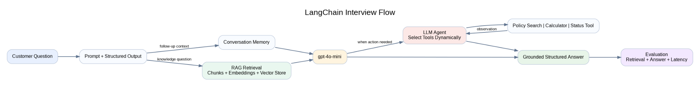
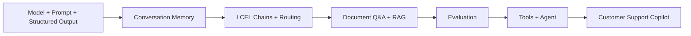

# LangChain, RAG and LLM Agents — Interview Guide

> **Purpose:** Fast interview revision based on a hands-on customer-support copilot built with modern LangChain APIs and `gpt-4o-mini`.

> **中文：** 基于现代 LangChain API 和 `gpt-4o-mini` 的客服 Copilot，用于快速面试复习。

## Overview

### What I built

I built a customer-support copilot with LangChain and gpt-4o-mini. It combines structured output, conversation memory, document-based RAG, evaluation, and agent-driven tool calling.

> **中文：** 我构建了一个客服 Copilot，整合结构化输出、会话记忆、文档 RAG、评估和 Agent 工具调用。

### Why this project matters

The project demonstrates how an LLM application can move beyond a single model call by connecting prompts, state, enterprise knowledge, tools, and evaluation into one controlled workflow.

> **中文：** 该项目展示了如何把 Prompt、状态、企业知识、工具和评估连接成一个可控的 LLM 工作流。

### One-line architecture

Customer question → prompt and intent processing → memory or RAG retrieval → gpt-4o-mini → structured answer → tool calling when needed → evaluation.

## Architecture and Flow



### Step-by-step explanation

1. **Prompt and structured output:** The request first enters a reusable prompt and a structured output layer so the model receives clear instructions and downstream systems receive validated fields.

   > **中文：** 请求先经过 Prompt 和结构化输出层，确保指令清晰并返回可验证字段。

2. **Memory or RAG retrieval:** Follow-up questions use conversation memory, while knowledge questions use document retrieval with chunks, embeddings, and a vector store.

   > **中文：** 追问使用会话记忆；知识问题通过文档切分、Embedding 和向量检索获得上下文。

3. **Model and agent decision:** `gpt-4o-mini` answers directly when context is sufficient, or delegates to an agent when an external action is required.

   > **中文：** 上下文足够时模型直接回答；需要外部动作时由 Agent 选择业务工具。

4. **Evaluation:** The response is evaluated across retrieval quality, answer quality, groundedness, source attribution, latency, and cost.

   > **中文：** 最终结果从检索、答案、依据性、来源、延迟和成本等方面评估。

```text
Customer Question → Prompt / Structured Output → Memory or RAG → gpt-4o-mini → Agent Tools when needed → Grounded Answer → Evaluation
```

## L1–L6

### L1 — Models, Prompts, and Structured Output

I initialized gpt-4o-mini, created reusable prompt templates, composed them with LCEL, and used Pydantic schemas to validate model outputs.

> **中文：** 我初始化模型、构建可复用 Prompt，并使用 Pydantic 验证结构化输出。

### L2 — Conversation Memory

I added a checkpointer and used a unique thread_id to isolate and restore each conversation. The model itself does not permanently remember the user; the application stores and reloads state.

> **中文：** 通过 checkpointer 和 thread_id 保存会话状态；记忆由应用管理，而不是模型永久保存。

### L3 — Chains with LCEL

I composed prompts, models, parsers, and Python functions into sequential, parallel, and routed chains. Chains are useful when the execution path should remain explicit and predictable.

> **中文：** 我用 LCEL 组合顺序、并行和路由流程；Chain 适合执行路径固定且可预测的场景。

### L4 — Document Q&A and RAG

I loaded support documents, split them into overlapping chunks, created embeddings, indexed them in a vector store, retrieved the top-k evidence, and passed the context to gpt-4o-mini for a grounded answer.

> **中文：** 文档经过切分、向量化和检索后，相关证据被交给模型生成有依据的答案。

### L5 — Evaluation

I evaluated retrieval quality and answer quality separately so I could identify whether a failure came from search, context quality, or generation.

> **中文：** 我分开评估检索和答案质量，以定位问题来自搜索、上下文还是生成。

### L6 — Agents and Tools

I defined tools with clear names, descriptions, and input schemas, then let the agent dynamically select a policy-search, calculator, or service-status tool.

> **中文：** 我定义了清晰的工具结构，由 Agent 根据请求动态选择合适的工具。

## Key Concepts

### LangChain

LangChain is an application framework for composing LLMs with prompts, structured output, memory, retrieval systems, tools, and agents.

### RAG

Retrieval-Augmented Generation retrieves relevant external knowledge and adds it to the model context before generation.

### Embedding

An embedding is a numeric vector that represents semantic meaning and enables similarity search between a question and document chunks.

### Vector Store

A vector store indexes embeddings and returns the most semantically similar chunks for a query.

### Chain versus Agent

A chain follows a predefined workflow, while an agent dynamically chooses tools and actions based on the request and tool observations.

> **中文：** Chain 的路径固定；Agent 会根据请求和工具结果动态决策。

### Function Calling versus Tool Execution

The model proposes a tool name and structured arguments. The application validates and executes the function, then returns the result to the model.

> **中文：** 模型只生成工具名称和参数；真正执行函数的是应用程序。

## Interview Talk Track

### 30-second answer

I built a customer-support copilot using LangChain and gpt-4o-mini. It supports structured ticket classification, thread-level memory, document-based RAG, source-grounded answers, evaluation, and agent-driven tool calling. I separated ingestion, retrieval, generation, and evaluation so each component can be tested and improved independently.

> **中文：** 我构建了客服 Copilot，并将数据接入、检索、生成和评估拆分，便于独立测试和优化。

### 60-second answer

I designed the project as an end-to-end LangChain application. First, I used prompt templates and Pydantic structured output to make responses predictable. I added a checkpointer with thread IDs for conversation memory. For knowledge questions, I implemented a two-step RAG pipeline: documents are chunked, embedded, indexed, and retrieved before gpt-4o-mini generates a source-grounded answer. I evaluated retrieval and answer quality separately. Finally, I defined business tools and created an agent that dynamically selects the appropriate tool. The current version is a working prototype; production improvements would include persistent storage, access control, tracing, monitoring, and a larger evaluation dataset.

> **中文：** 项目覆盖结构化输出、会话记忆、两阶段 RAG、分层评估和工具调用 Agent；生产化还需持久化、权限和监控。

### Honest positioning

I have hands-on prototype experience with LangChain, RAG, structured output, conversation memory, evaluation, and LLM agents.

### Resume line

Built a LangChain RAG prototype with document ingestion, embeddings, retrieval, memory, tool calling, and agent routing.

## Interview Q&A

### Why use LangChain instead of calling the model API directly?

For a single model call, the native API may be simpler. LangChain becomes valuable when the application connects prompts, parsers, memory, retrieval, tools, agents, and evaluation.

> **中文：** 单次调用原生 API 更简单；多组件工作流中 LangChain 更有价值。

### What is the difference between a prompt and a chain?

A prompt defines instructions and input variables. A chain connects the prompt with a model, parser, retriever, or other processing steps.

### Why use structured output?

Structured output provides predictable fields, validation, type safety, and easier integration with APIs, databases, and automated workflows.

### How does memory work?

The application stores messages or state through a checkpointer and retrieves them using a conversation identifier such as thread_id. It is not permanent memory inside the model.

> **中文：** 应用通过 checkpointer 和 thread_id 保存状态，并不是模型内部的永久记忆。

### What problem does RAG solve?

RAG gives the model access to private or current knowledge and reduces unsupported answers without fine-tuning the base model.

### Why split documents into chunks?

Chunking improves retrieval precision and keeps context within model limits. Very large chunks reduce precision, while very small chunks may lose context.

### Why use chunk overlap?

Overlap reduces the chance that important information is split across chunk boundaries, although excessive overlap increases duplication and cost.

### How do embeddings work in RAG?

Document chunks and the user query are converted into vectors. Similar vectors are expected to represent similar semantic meaning, enabling nearest-neighbor retrieval.

### What is top-k retrieval?

Top-k retrieval returns the k most similar document chunks. A higher k may improve recall but can also add noise and token cost.

### How do you reduce hallucinations?

I use a grounding prompt, high-quality retrieved context, source references, an explicit insufficient-evidence response, and groundedness evaluation.

### How do you evaluate RAG?

I evaluate retrieval relevance or recall, answer correctness, groundedness, source attribution, latency, and cost. Retrieval and generation should be tested separately.

> **中文：** 我分别测试检索和生成，并评估相关性、正确性、依据性、来源、延迟和成本。

### What is the difference between a chain and an agent?

A chain follows a fixed workflow. An agent uses the model to choose tools and actions dynamically, which adds flexibility but also increases latency, cost, and unpredictability.

> **中文：** Agent 更灵活，但也会增加延迟、成本和不确定性。

### What makes a good tool?

A good tool has one clear responsibility, a descriptive name, a precise docstring, a strict input schema, predictable output, and controlled side effects.

### Does the model execute the tool?

No. The model proposes the tool call and arguments. The application validates and executes the tool, then sends the result back to the model.

### When would you avoid an agent?

I avoid an agent when the workflow is fixed, compliance requires strict control, latency is critical, or a deterministic chain can solve the problem reliably.

### What would you improve for production?

I would add persistent memory and vector storage, authentication, document-level authorization, tracing, prompt and model versioning, offline evaluation, monitoring, retries, rate limits, and secret management.

> **中文：** 生产化需要持久化、权限控制、追踪、版本管理、离线评估、监控和密钥管理。

## Fast Memory Map

```text
LangChain = application composition
Prompt = reusable instructions
Structured Output = validated fields
Memory = application-managed state
LCEL Chain = explicit workflow
RAG = retrieve before generate
Embedding = semantic vector
Vector Store = similarity index
Tool = callable capability
Agent = dynamic action selection
Evaluation = retrieval + answer + operations
```

### Final interview positioning

> I have hands-on prototype experience with LangChain, RAG, structured output, conversation memory, evaluation, and LLM agents.

---

# 8. Complete Guide

> **Purpose:** Complete interview-first revision based on a customer-support copilot using modern LangChain APIs and `gpt-4o-mini`.

## 1. What I Built

I built a customer-support copilot that combines prompt templates, structured output, conversation memory, LCEL chains, document retrieval, RAG evaluation, and tool-calling agents.

> **中文：** 我构建了客服 Copilot，整合 Prompt、结构化输出、会话记忆、RAG、评估和工具调用 Agent。

## 2. End-to-End Learning Flow


```text
Customer Question → Prompt / Memory / RAG → gpt-4o-mini → Agent Tools when needed → Grounded Answer → Evaluation
```

## 3. L1–L6 Summary

### L1 — Models, Prompts and Structured Output

#### What I learned

I learned how to initialize gpt-4o-mini, design reusable prompts, compose components with LCEL, and validate outputs with Pydantic.

> **中文：** 我使用 Prompt、LCEL 和 Pydantic，让模型输出可以被程序稳定消费。

#### Core flow

```text
Input → Prompt Template → gpt-4o-mini → Structured Output → Validated Result
```

#### Example

I used a support-ticket schema with fields such as category, priority, sentiment, and summary.

#### Interview explanation

I used structured output because downstream systems should consume validated fields instead of unpredictable free-form text.

### L2 — Conversation Memory

#### What I learned

I learned that memory is managed by the application, not permanently stored inside the model.

> **中文：** 会话记忆由应用通过 checkpointer 和 thread_id 管理，并不是模型永久记住用户。

#### Core flow

```text
Message 1 → Checkpointer → thread_id → Restore Context → Message 2
```

#### Example

The user first says, “My name is Blair and I use the Pro plan,” then asks a follow-up question in the same thread.

#### Interview explanation

I used a checkpointer and a unique thread ID to isolate conversations and restore prior messages.

### L3 — Chains with LCEL

#### What I learned

I learned how to compose deterministic workflows using sequential, parallel, and routed LCEL chains.

> **中文：** Chain 适合执行顺序固定、需要明确控制和测试的流程。

#### Core flow

```text
Input → Classify Intent → Route → Specialized Chain → Parsed Result
```

#### Example

A support request can be routed to billing, technical support, or account-management prompts.

#### Interview explanation

I use chains when the execution order should remain explicit, testable, and predictable.

### L4 — Document Q&A and RAG

#### What I learned

I learned how to ground model answers in external documents through chunking, embeddings, semantic retrieval, and context injection.

> **中文：** RAG 先检索证据，再让模型回答；检索与生成可以分开评估。

#### Core flow

```text
Documents → Chunks → Embeddings → Vector Store → Top-k Retrieval → Context → gpt-4o-mini → Answer + Sources
```

#### Example

The copilot retrieves refund-policy or troubleshooting content before answering a customer question.

#### Interview explanation

I implemented two-step RAG so retrieval and generation can be evaluated and improved independently.

### L5 — Evaluation

#### What I learned

I learned to evaluate retrieval quality and answer quality separately instead of treating RAG as one black box.

> **中文：** 检索错误时，仅调整 Prompt 无法解决问题，因此需要分层评估。

#### Core flow

```text
Test Question → Retrieval Check → Answer Generation → Correctness / Groundedness Check
```

#### Example

A small evaluation set checks whether the expected document was retrieved and whether the answer is supported by the context.

#### Interview explanation

If retrieval is wrong, prompt tuning alone cannot fix the answer, so I test retrieval and generation separately.

### L6 — Agents and Tools

#### What I learned

I learned how to define tools with clear schemas and let an LLM agent dynamically select the next action.

> **中文：** Agent 适合动态选择工具；固定流程通常用 Chain 更简单、更安全。

#### Core flow

```text
User Request → Agent → Select Tool → Execute → Observe Result → Final Answer
```

#### Example

The agent can choose a policy-search tool, refund calculator, or service-status tool based on the request.

#### Interview explanation

I use an agent when the execution path cannot be fully predefined; fixed workflows remain better suited to chains.

## 4. Core Concepts

### LangChain

LangChain is an application framework for composing LLMs with prompts, structured output, memory, retrieval systems, tools, and agents.

### RAG

Retrieval-Augmented Generation retrieves relevant external knowledge and adds it to the model context before generation.

### Embedding

An embedding is a numeric vector representing semantic meaning and enabling similarity search between questions and document chunks.

### Chain versus Agent

A chain follows a predefined path, while an agent dynamically chooses actions and tools based on the request and observations.

> **中文：** Chain 路径固定；Agent 根据请求和工具结果动态决策。

## 5. How I Explain the Project

### 30-second answer

I built a customer-support copilot using LangChain and gpt-4o-mini. It supports structured output, thread-level memory, document-based RAG, source-grounded answers, evaluation, and agent-driven tool calling. I separated ingestion, retrieval, generation, and evaluation so each component can be tested and improved independently.

### Resume line

Built a LangChain RAG prototype with document ingestion, embeddings, retrieval, memory, tool calling, and agent routing.

## 6. Common Interview Q&A

### Why use LangChain instead of the native model API?

The native API is simpler for one model call. LangChain becomes useful when the application connects prompts, parsers, memory, retrieval, tools, agents, and evaluation.

> **中文：** 单次调用原生 API 更简单；多组件工作流中 LangChain 更有价值。

### What is RAG?

RAG retrieves relevant external knowledge and adds it to the model context before generation.

> **中文：** RAG 先检索外部知识，再将相关证据加入模型上下文。

### Why split documents into chunks?

Chunking improves retrieval precision and keeps the context within model limits. Chunk size and overlap should be tuned for the document type.

> **中文：** 切分提高检索精度并控制上下文长度。

### How do embeddings work?

Embeddings represent semantic meaning as numeric vectors, allowing similar questions and document chunks to be matched through vector similarity.

> **中文：** Embedding 将语义表示为向量，用于相似度检索。

### How do you evaluate RAG?

I evaluate retrieval relevance, answer correctness, groundedness, source attribution, latency, and cost, and I test retrieval and generation separately.

> **中文：** 我分别评估检索与生成，并关注正确性、依据性、来源、延迟和成本。

### What is the difference between a chain and an agent?

A chain follows a predefined workflow. An agent dynamically selects tools and actions, which adds flexibility but also increases cost, latency, and unpredictability.

> **中文：** Chain 路径固定；Agent 动态决策，但会增加成本、延迟和不确定性。

### Does the model execute a tool?

No. The model proposes the tool name and structured arguments. The application validates and executes the function, then returns the result to the model.

### What would you add for production?

I would add persistent storage, authentication, document-level authorization, tracing, versioning, offline evaluation, monitoring, retries, rate limits, and secret management.

> **中文：** 生产化需要持久化、权限控制、追踪、版本管理、监控和密钥管理。

## 7. Fast Memory Map

```text
LangChain = application composition
Prompt = reusable instructions
Structured Output = validated fields
Memory = application-managed state
LCEL Chain = explicit workflow
RAG = retrieve before generate
Embedding = semantic vector
Vector Store = similarity index
Tool = callable capability
Agent = dynamic action selection
Evaluation = retrieval + answer + operations
```

---

## Complete Guide — Full Reference

<div id="title-block-header">

# LangChain, RAG and LLM Agents — Interview Guide

</div>

- <a href="#langchain-rag-and-llm-agents-interview-guide"
  id="toc-langchain-rag-and-llm-agents-interview-guide">LangChain, RAG and
  LLM Agents — Interview Guide</a>
  - <a href="#what-i-built" id="toc-what-i-built">1. What I Built</a>
    - <a href="#main-capabilities" id="toc-main-capabilities">Main
      capabilities</a>
    - <a href="#honest-project-scope" id="toc-honest-project-scope">Honest
      project scope</a>
  - <a href="#end-to-end-learning-flow" id="toc-end-to-end-learning-flow">2.
    End-to-End Learning Flow</a>
- <a href="#l1l6-summary" id="toc-l1l6-summary">3. L1–L6 Summary</a>
  - <a href="#l1-models-prompts-and-structured-output"
    id="toc-l1-models-prompts-and-structured-output">L1 — Models, Prompts
    and Structured Output</a>
    - <a href="#what-i-learned" id="toc-what-i-learned">What I learned</a>
    - <a href="#core-flow" id="toc-core-flow">Core flow</a>
    - <a href="#example" id="toc-example">Example</a>
    - <a href="#interview-explanation"
      id="toc-interview-explanation">Interview explanation</a>
  - <a href="#l2-conversation-memory" id="toc-l2-conversation-memory">L2 —
    Conversation Memory</a>
    - <a href="#what-i-learned-1" id="toc-what-i-learned-1">What I learned</a>
    - <a href="#core-flow-1" id="toc-core-flow-1">Core flow</a>
    - <a href="#example-1" id="toc-example-1">Example</a>
    - <a href="#interview-explanation-1"
      id="toc-interview-explanation-1">Interview explanation</a>
  - <a href="#l3-chains-with-lcel" id="toc-l3-chains-with-lcel">L3 — Chains
    with LCEL</a>
    - <a href="#what-i-learned-2" id="toc-what-i-learned-2">What I learned</a>
    - <a href="#core-flow-2" id="toc-core-flow-2">Core flow</a>
    - <a href="#example-2" id="toc-example-2">Example</a>
    - <a href="#interview-explanation-2"
      id="toc-interview-explanation-2">Interview explanation</a>
  - <a href="#l4-document-qa-and-rag" id="toc-l4-document-qa-and-rag">L4 —
    Document Q&amp;A and RAG</a>
    - <a href="#what-i-learned-3" id="toc-what-i-learned-3">What I learned</a>
    - <a href="#rag-flow" id="toc-rag-flow">RAG flow</a>
    - <a href="#example-3" id="toc-example-3">Example</a>
    - <a href="#why-chunk-overlap-matters"
      id="toc-why-chunk-overlap-matters">Why chunk overlap matters</a>
    - <a href="#interview-explanation-3"
      id="toc-interview-explanation-3">Interview explanation</a>
  - <a href="#l5-evaluation" id="toc-l5-evaluation">L5 — Evaluation</a>
    - <a href="#what-i-learned-4" id="toc-what-i-learned-4">What I learned</a>
    - <a href="#evaluation-flow" id="toc-evaluation-flow">Evaluation flow</a>
    - <a href="#important-metrics" id="toc-important-metrics">Important
      metrics</a>
    - <a href="#interview-explanation-4"
      id="toc-interview-explanation-4">Interview explanation</a>
  - <a href="#l6-agents-and-tools" id="toc-l6-agents-and-tools">L6 — Agents
    and Tools</a>
    - <a href="#what-i-learned-5" id="toc-what-i-learned-5">What I learned</a>
    - <a href="#agent-flow" id="toc-agent-flow">Agent flow</a>
    - <a href="#example-4" id="toc-example-4">Example</a>
    - <a href="#chain-versus-agent" id="toc-chain-versus-agent">Chain versus
      Agent</a>
    - <a href="#interview-explanation-5"
      id="toc-interview-explanation-5">Interview explanation</a>
- <a href="#langchain-rag-and-llm-agents-key-definitions"
  id="toc-langchain-rag-and-llm-agents-key-definitions">4. LangChain, RAG
  and LLM Agents — Key Definitions</a>
  - <a href="#what-is-langchain" id="toc-what-is-langchain">What is
    LangChain?</a>
  - <a href="#what-is-rag" id="toc-what-is-rag">What is RAG?</a>
  - <a href="#what-is-an-llm-agent" id="toc-what-is-an-llm-agent">What is an
    LLM Agent?</a>
  - <a href="#what-is-an-embedding" id="toc-what-is-an-embedding">What is an
    embedding?</a>
  - <a href="#what-is-a-vector-store" id="toc-what-is-a-vector-store">What
    is a vector store?</a>
- <a href="#how-to-explain-the-project-in-an-interview"
  id="toc-how-to-explain-the-project-in-an-interview">5. How to Explain
  the Project in an Interview</a>
  - <a href="#second-answer" id="toc-second-answer">30-second answer</a>
  - <a href="#second-answer-1" id="toc-second-answer-1">60-second answer</a>
  - <a href="#resume-bullet" id="toc-resume-bullet">Resume bullet</a>
  - <a href="#stronger-two-bullet-version"
    id="toc-stronger-two-bullet-version">Stronger two-bullet version</a>
- <a href="#common-interview-questions-and-answers"
  id="toc-common-interview-questions-and-answers">6. Common Interview
  Questions and Answers</a>
  - <a
    href="#q1.-why-use-langchain-instead-of-calling-the-openai-api-directly"
    id="toc-q1.-why-use-langchain-instead-of-calling-the-openai-api-directly">Q1.
    Why use LangChain instead of calling the OpenAI API directly?</a>
  - <a href="#q2.-what-is-the-difference-between-a-prompt-and-a-chain"
    id="toc-q2.-what-is-the-difference-between-a-prompt-and-a-chain">Q2.
    What is the difference between a prompt and a chain?</a>
  - <a href="#q3.-what-is-the-difference-between-a-chain-and-an-agent"
    id="toc-q3.-what-is-the-difference-between-a-chain-and-an-agent">Q3.
    What is the difference between a chain and an agent?</a>
  - <a href="#q4.-how-does-rag-reduce-hallucination"
    id="toc-q4.-how-does-rag-reduce-hallucination">Q4. How does RAG reduce
    hallucination?</a>
  - <a href="#q5.-why-split-documents-into-chunks"
    id="toc-q5.-why-split-documents-into-chunks">Q5. Why split documents
    into chunks?</a>
  - <a href="#q6.-how-did-you-choose-chunk-size-and-overlap"
    id="toc-q6.-how-did-you-choose-chunk-size-and-overlap">Q6. How did you
    choose chunk size and overlap?</a>
  - <a
    href="#q7.-what-happens-when-the-retriever-returns-irrelevant-context"
    id="toc-q7.-what-happens-when-the-retriever-returns-irrelevant-context">Q7.
    What happens when the retriever returns irrelevant context?</a>
  - <a href="#q8.-what-is-top-k-retrieval"
    id="toc-q8.-what-is-top-k-retrieval">Q8. What is top-k retrieval?</a>
  - <a href="#q9.-how-did-you-evaluate-the-rag-system"
    id="toc-q9.-how-did-you-evaluate-the-rag-system">Q9. How did you
    evaluate the RAG system?</a>
  - <a href="#q10.-what-is-llm-as-a-judge"
    id="toc-q10.-what-is-llm-as-a-judge">Q10. What is LLM-as-a-judge?</a>
  - <a href="#q11.-how-is-memory-implemented"
    id="toc-q11.-how-is-memory-implemented">Q11. How is memory
    implemented?</a>
  - <a href="#q12.-what-is-structured-output-and-why-is-it-useful"
    id="toc-q12.-what-is-structured-output-and-why-is-it-useful">Q12. What
    is structured output and why is it useful?</a>
  - <a href="#q13.-what-makes-a-good-tool-definition"
    id="toc-q13.-what-makes-a-good-tool-definition">Q13. What makes a good
    tool definition?</a>
  - <a href="#q14.-when-should-you-avoid-an-agent"
    id="toc-q14.-when-should-you-avoid-an-agent">Q14. When should you avoid
    an agent?</a>
  - <a href="#q15.-how-would-you-productionize-this-prototype"
    id="toc-q15.-how-would-you-productionize-this-prototype">Q15. How would
    you productionize this prototype?</a>
  - <a href="#q16.-how-would-you-secure-enterprise-rag"
    id="toc-q16.-how-would-you-secure-enterprise-rag">Q16. How would you
    secure enterprise RAG?</a>
  - <a href="#q17.-how-would-you-reduce-cost-and-latency"
    id="toc-q17.-how-would-you-reduce-cost-and-latency">Q17. How would you
    reduce cost and latency?</a>
  - <a href="#q18.-why-gpt-4o-mini" id="toc-q18.-why-gpt-4o-mini">Q18. Why
    <code>gpt-4o-mini</code>?</a>
  - <a href="#q19.-did-you-use-faiss" id="toc-q19.-did-you-use-faiss">Q19.
    Did you use FAISS?</a>
  - <a href="#q20.-is-this-production-ready"
    id="toc-q20.-is-this-production-ready">Q20. Is this
    production-ready?</a>
- <a href="#design-decisions-and-trade-offs"
  id="toc-design-decisions-and-trade-offs">7. Design Decisions and
  Trade-offs</a>
- <a href="#production-extension-roadmap"
  id="toc-production-extension-roadmap">8. Production Extension
  Roadmap</a>
- <a href="#final-interview-cheat-sheet"
  id="toc-final-interview-cheat-sheet">9. Final Interview Cheat Sheet</a>
  - <a href="#best-closing-statement" id="toc-best-closing-statement">Best
    closing statement</a>

# LangChain, RAG and LLM Agents — Interview Guide

> **Positioning:** This document summarizes a hands-on learning
> prototype built with modern LangChain APIs and `gpt-4o-mini`.
>
> **中文：** 本文用于总结一个基于现代 LangChain API 和 `gpt-4o-mini`
> 的可运行学习项目。

------------------------------------------------------------------------

## 1. What I Built

I built a **customer-support copilot prototype** that combines prompt
engineering, structured output, conversation memory, LCEL chains,
document retrieval, RAG evaluation, and tool-calling agents.

> **中文：** 我构建了一个客服 Copilot
> 原型，整合了提示词、结构化输出、对话记忆、LCEL、文档检索、RAG
> 评估和工具调用 Agent。

### Main capabilities

- Rewrite and classify customer messages with structured output.
- Remember customer context within the same conversation thread.
- Route requests through deterministic LCEL chains.
- Retrieve relevant support-policy content before answering.
- Evaluate retrieval quality and answer quality separately.
- Let an LLM agent select and call the appropriate tool.

### Honest project scope

This is a **working portfolio prototype**, not a production deployment.
It demonstrates the end-to-end design and the key engineering concepts
required to evolve toward a production AI application.

> **中文：**
> 这是可运行的作品集原型，而不是已经投产的系统；它展示了完整设计及生产化所需的核心工程概念。

------------------------------------------------------------------------

## 2. End-to-End Learning Flow

<figure>

<figcaption aria-hidden="true">LangChain interview flow</figcaption>
</figure>



------------------------------------------------------------------------

# 3. L1–L6 Summary

## L1 — Models, Prompts and Structured Output

### What I learned

- Created a `ChatOpenAI` model using `gpt-4o-mini`.
- Used `ChatPromptTemplate` to separate reusable instructions from
  runtime input.
- Built an LCEL pipeline using `prompt | model | parser`.
- Used Pydantic schemas and `with_structured_output()` to return
  validated fields instead of free-form text.

### Core flow

``` text
User Input → Prompt Template → gpt-4o-mini → Output Parser → Typed Result
```

### Example

<div id="cb3" class="sourceCode">

``` sourceCode
from pydantic import BaseModel, Field
from langchain_openai import ChatOpenAI

class TicketClassification(BaseModel):
    category: str = Field(description="Ticket category")
    priority: str = Field(description="low, medium, or high")
    summary: str = Field(description="Short summary")

model = ChatOpenAI(model="gpt-4o-mini", temperature=0)
structured_model = model.with_structured_output(TicketClassification)

result = structured_model.invoke(
    "The API has been unavailable for all users for 30 minutes."
)
```

</div>

### Interview explanation

> I used prompt templates to standardize model instructions and Pydantic
> structured output to make the LLM response predictable, validated, and
> easier to integrate with downstream services.

> **中文：** 我用 Prompt Template 统一模型指令，并通过 Pydantic
> 结构化输出，让结果更稳定、可验证，也更方便下游系统使用。

------------------------------------------------------------------------

## L2 — Conversation Memory

### What I learned

- Created an agent with a checkpointer.
- Used `thread_id` to isolate different conversations.
- Verified that a follow-up question could reuse facts from an earlier
  message.

### Core flow

``` text
Message 1 → Save under thread_id → Message 2 → Load prior context → Answer
```

### Example

<div id="cb5" class="sourceCode">

``` sourceCode
from langchain.agents import create_agent
from langchain_openai import ChatOpenAI
from langgraph.checkpoint.memory import InMemorySaver

model = ChatOpenAI(model="gpt-4o-mini", temperature=0)
memory = InMemorySaver()

agent = create_agent(
    model=model,
    tools=[],
    system_prompt="You are a helpful customer-support assistant.",
    checkpointer=memory,
)

config = {"configurable": {"thread_id": "customer-001"}}
```

</div>

### Interview explanation

> The model itself does not permanently remember the user. The
> application stores conversation state through a checkpointer and
> retrieves it using the same thread ID.

> **中文：** 模型本身不会永久记住用户；应用通过 checkpointer
> 保存会话状态，并使用相同的 thread ID 读取历史。

------------------------------------------------------------------------

## L3 — Chains with LCEL

### What I learned

- Used LCEL to compose prompt, model, parser, and Python functions.
- Built sequential and parallel processing flows.
- Implemented routing based on request type.
- Understood that chains are deterministic workflows defined by the
  developer.

### Core flow

``` text
Input → Classify Intent → Route → Specialized Chain → Result
```

### Example

<div id="cb7" class="sourceCode">

``` sourceCode
from langchain_core.prompts import ChatPromptTemplate
from langchain_core.output_parsers import StrOutputParser

prompt = ChatPromptTemplate.from_template(
    "Write a concise support response for this issue:\n{issue}"
)

chain = prompt | model | StrOutputParser()
answer = chain.invoke({"issue": "I cannot log in to my account."})
```

</div>

### Interview explanation

> I used LCEL to create explicit, testable pipelines. A chain follows a
> predefined path, which makes it suitable when execution order must
> remain predictable.

> **中文：** 我用 LCEL 构建明确且可测试的处理链；Chain
> 按预定义路径执行，适合要求流程稳定可控的场景。

------------------------------------------------------------------------

## L4 — Document Q&A and RAG

### What I learned

- Converted support documents into LangChain `Document` objects.
- Split long documents into overlapping chunks.
- Converted chunks into embeddings.
- Stored embeddings in `InMemoryVectorStore`.
- Retrieved top-k semantically relevant chunks.
- Added retrieved context to the prompt before generating an answer.
- Returned source metadata with the answer.

### RAG flow

``` text
Documents
→ Chunking
→ Embeddings
→ Vector Store
→ Retriever
→ Relevant Context
→ gpt-4o-mini
→ Grounded Answer + Sources
```

### Example

<div id="cb9" class="sourceCode">

``` sourceCode
from langchain_core.vectorstores import InMemoryVectorStore
from langchain_openai import OpenAIEmbeddings
from langchain_text_splitters import RecursiveCharacterTextSplitter

splitter = RecursiveCharacterTextSplitter(
    chunk_size=300,
    chunk_overlap=50,
)
chunks = splitter.split_documents(documents)

embeddings = OpenAIEmbeddings(model="text-embedding-3-small")
vector_store = InMemoryVectorStore(embeddings)
vector_store.add_documents(chunks)

retriever = vector_store.as_retriever(search_kwargs={"k": 2})
relevant_docs = retriever.invoke("What is the refund policy?")
```

</div>

### Why chunk overlap matters

Chunk overlap reduces the chance that important context is split across
chunk boundaries, although excessive overlap increases indexing cost and
duplicate retrieval.

> **中文：** Chunk overlap
> 可以降低重要上下文被切断的风险，但过大会增加索引成本和重复检索。

### Interview explanation

> I implemented a two-step RAG workflow. The retriever first finds the
> most relevant document chunks, and the model then generates an answer
> using only that retrieved context. This reduces unsupported answers
> and enables source attribution.

> **中文：** 我实现了两阶段
> RAG：先检索相关文档片段，再让模型仅基于这些上下文回答，从而减少无依据回答并支持来源追踪。

------------------------------------------------------------------------

## L5 — Evaluation

### What I learned

- Created a small evaluation dataset with questions and expected topics.
- Evaluated whether the retriever returned the expected evidence.
- Evaluated whether the generated answer was correct and grounded.
- Used structured LLM-as-a-judge output for repeatable scoring.

### Evaluation flow

``` text
Test Question
→ Retrieve Context
→ Generate Answer
→ Retrieval Evaluation
→ Answer Evaluation
→ Score and Failure Analysis
```

### Important metrics

| Layer      | What to evaluate                             |
|------------|----------------------------------------------|
| Retrieval  | Recall@k, relevance, correct source returned |
| Generation | Correctness, groundedness, completeness      |
| System     | Latency, token usage, cost, failure rate     |

### Interview explanation

> I separated retrieval evaluation from generation evaluation because a
> wrong answer may come from poor retrieval or from incorrect reasoning
> over correct context. The two failure modes require different fixes.

> **中文：**
> 我把检索评估和生成评估分开，因为错误可能来自检索不到正确资料，也可能来自模型对正确资料推理错误，两者需要不同优化方式。

------------------------------------------------------------------------

## L6 — Agents and Tools

### What I learned

- Defined tools with clear names, descriptions, and typed arguments.
- Created an LLM agent using `create_agent()`.
- Allowed the model to decide whether and which tool to call.
- Inspected the resulting message history and tool calls.
- Reused thread-level memory with the agent.

### Agent flow

``` text
User Request
→ LLM Reasons About Intent
→ Select Tool
→ Execute Tool
→ Observe Tool Result
→ Generate Final Answer
```

### Example

<div id="cb12" class="sourceCode">

``` sourceCode
from langchain.tools import tool
from langchain.agents import create_agent

@tool
def calculate_refund(amount: float, percentage: float) -> float:
    """Calculate a refund amount using a percentage."""
    return round(amount * percentage / 100, 2)

agent = create_agent(
    model=model,
    tools=[calculate_refund],
    system_prompt="Use tools when calculation is required.",
)
```

</div>

### Chain versus Agent

| Chain                                | Agent                               |
|--------------------------------------|-------------------------------------|
| Developer defines the execution path | LLM selects the next action         |
| Predictable and easier to test       | Flexible but more variable          |
| Lower latency and cost               | Often requires multiple model calls |
| Best for stable workflows            | Best for dynamic tool selection     |

### Interview explanation

> I used agents only where dynamic tool selection added value. For
> predictable retrieval pipelines, I kept an explicit chain because it
> is easier to test, control, and optimize.

> **中文：** 我只在动态工具选择有价值时使用 Agent；对于固定 RAG
> 流程，我保留明确的 Chain，因为它更容易测试、控制和优化。

------------------------------------------------------------------------

# 4. LangChain, RAG and LLM Agents — Key Definitions

## What is LangChain?

LangChain is an application framework for composing LLMs with prompts,
structured outputs, retrieval systems, tools, memory, and workflow
logic.

> **中文：** LangChain
> 是连接模型、提示词、结构化输出、检索、工具、记忆和工作流逻辑的 LLM
> 应用框架。

## What is RAG?

Retrieval-Augmented Generation retrieves relevant information from an
external knowledge source and provides it to the LLM before answer
generation.

> **中文：** RAG
> 在生成答案前先从外部知识库检索相关资料，并把资料提供给模型。

## What is an LLM Agent?

An LLM agent uses the model to decide which action or tool should be
executed next, based on the current goal and previous observations.

> **中文：** LLM Agent
> 根据目标和已有结果，自主决定下一步动作或需要调用的工具。

## What is an embedding?

An embedding is a numerical vector that represents semantic meaning,
allowing similar text to be found through vector similarity search.

> **中文：** Embedding
> 是表达语义的数值向量，用于通过向量相似度查找语义接近的文本。

## What is a vector store?

A vector store saves embeddings and supports similarity search over
them. In this prototype, I used `InMemoryVectorStore`; a production
system could use FAISS, Milvus, Pinecone, OpenSearch, or another managed
solution.

> **中文：** 向量库保存 embedding
> 并提供相似度检索；本原型使用内存向量库，生产环境可替换为
> FAISS、Milvus、Pinecone 或 OpenSearch。

------------------------------------------------------------------------

# 5. How to Explain the Project in an Interview

## 30-second answer

> I built a customer-support copilot prototype using LangChain and
> `gpt-4o-mini`. It supports prompt templates, structured outputs,
> conversation memory, LCEL chains, document retrieval, two-step RAG,
> evaluation, and tool-calling agents. I focused on separating
> ingestion, retrieval, generation, and evaluation so that each layer
> could be tested and improved independently.

## 60-second answer

> I built an end-to-end LangChain prototype for customer support. First,
> I used prompt templates and Pydantic structured output to make model
> responses predictable. I added thread-level memory so follow-up
> questions could reuse customer context. For document Q&A, I split
> policy documents into overlapping chunks, generated embeddings,
> indexed them in an in-memory vector store, and retrieved the top
> relevant chunks before calling `gpt-4o-mini`. I then evaluated
> retrieval and answer quality separately. Finally, I created tools and
> an agent that could decide whether to retrieve policy information or
> perform a calculation. The project is a working prototype, and the
> next production steps would include persistent storage, access
> control, observability, and a managed vector database.

> **中文：** 该项目从结构化输出、记忆、RAG 到 Agent
> 工具调用形成完整链路，并明确区分当前原型和未来生产化能力。

## Resume bullet

> Built a LangChain-based customer-support copilot prototype with
> structured outputs, thread-level memory, LCEL workflows, document RAG,
> retrieval/answer evaluation, and tool-calling agents using
> `gpt-4o-mini`.

## Stronger two-bullet version

- Built a modular LangChain customer-support copilot using
  `gpt-4o-mini`, covering prompt templates, Pydantic structured output,
  conversation memory, LCEL routing, and tool-calling agents.
- Implemented a two-step RAG pipeline with document chunking, OpenAI
  embeddings, semantic retrieval, source-grounded generation, and
  separate retrieval/answer evaluation.

------------------------------------------------------------------------

# 6. Common Interview Questions and Answers

## Q1. Why use LangChain instead of calling the OpenAI API directly?

> Direct API calls are enough for simple prompts. I used LangChain
> because the application required reusable prompts, structured outputs,
> retrieval, memory, tools, and composable workflows. LangChain reduced
> integration boilerplate and provided consistent abstractions for these
> components.

## Q2. What is the difference between a prompt and a chain?

> A prompt defines the instruction and input format sent to the model. A
> chain composes multiple processing steps, such as prompt formatting,
> model invocation, parsing, retrieval, or routing.

## Q3. What is the difference between a chain and an agent?

> A chain follows a developer-defined execution path. An agent uses the
> LLM to choose the next tool or action dynamically. I prefer chains for
> predictable workflows and agents for requests requiring flexible tool
> selection.

## Q4. How does RAG reduce hallucination?

> RAG provides relevant external evidence in the model context and
> instructs the model to answer from that evidence. It does not
> eliminate hallucination completely, so source attribution and
> evaluation are still required.

## Q5. Why split documents into chunks?

> Entire documents may exceed the context window and contain unrelated
> information. Chunking creates smaller retrievable units so the system
> can send only relevant evidence to the model.

## Q6. How did you choose chunk size and overlap?

> I started with a small configurable chunk size and overlap for the
> prototype, then evaluated whether retrieved chunks contained enough
> complete context. In production, I would tune these values using
> retrieval recall, answer quality, document structure, latency, and
> cost.

## Q7. What happens when the retriever returns irrelevant context?

> The answer quality usually degrades even if the model is strong. I
> would inspect retrieval results, improve chunking and metadata, adjust
> top-k, add query rewriting or reranking, and measure retrieval recall
> separately.

## Q8. What is top-k retrieval?

> Top-k is the number of most similar chunks returned by the retriever.
> A small k may miss evidence, while a large k may add noise, latency,
> and token cost.

## Q9. How did you evaluate the RAG system?

> I used a small test dataset and evaluated two stages separately:
> whether the correct source was retrieved and whether the generated
> answer was correct and grounded in the retrieved context.

## Q10. What is LLM-as-a-judge?

> It uses another model call to score an output against defined criteria
> such as correctness or groundedness. It is scalable but not perfectly
> objective, so I would combine it with deterministic checks and human
> review for important use cases.

## Q11. How is memory implemented?

> The application uses a checkpointer and a `thread_id`. Messages are
> stored under a conversation thread and loaded again for follow-up
> requests. It is application-managed state, not permanent memory inside
> the model.

## Q12. What is structured output and why is it useful?

> Structured output constrains the response to a defined schema, such as
> a Pydantic model. It improves validation, testing, API integration,
> and downstream automation compared with parsing arbitrary text.

## Q13. What makes a good tool definition?

> A tool needs a clear name, precise description, typed arguments,
> predictable output, input validation, and controlled side effects. The
> description is important because the model uses it when deciding
> whether to call the tool.

## Q14. When should you avoid an agent?

> I would avoid an agent when the workflow is fixed, latency-sensitive,
> inexpensive to express as a chain, or requires strict deterministic
> control. Agents add model calls, cost, latency, and debugging
> complexity.

## Q15. How would you productionize this prototype?

> I would add persistent vector storage, document versioning, metadata
> filtering, authentication and document-level authorization,
> prompt/version management, tracing, token and latency monitoring,
> offline evaluation, CI/CD, caching, rate limiting, and fallback
> handling.

## Q16. How would you secure enterprise RAG?

> I would enforce access control before retrieval, filter documents by
> user permissions, encrypt data in transit and at rest, redact
> sensitive data, log retrieval and generation events, and prevent
> unauthorized content from entering the model context.

## Q17. How would you reduce cost and latency?

> I would cache embeddings and repeated answers, use smaller models
> where sufficient, limit top-k and context size, batch indexing
> operations, avoid unnecessary agent loops, and monitor token usage per
> workflow.

## Q18. Why `gpt-4o-mini`?

> It is suitable for a learning prototype because it offers good quality
> with relatively low latency and cost. Model choice should still be
> validated against task accuracy, context requirements, latency, and
> budget.

## Q19. Did you use FAISS?

> In the L1–L6 notebook prototype, I used `InMemoryVectorStore`. I
> understand FAISS as a local vector-similarity library and can replace
> the in-memory store with FAISS when local persistence or larger-scale
> retrieval is required.

## Q20. Is this production-ready?

> No. It is a working portfolio prototype designed to demonstrate the
> complete architecture and core implementation. Production readiness
> would require security, persistent infrastructure, observability,
> evaluation gates, scalability testing, and operational controls.

------------------------------------------------------------------------

# 7. Design Decisions and Trade-offs

| Decision               | Why                                   | Limitation                                 |
|------------------------|---------------------------------------|--------------------------------------------|
| `gpt-4o-mini`          | Low-cost, fast prototype model        | Must validate quality for production tasks |
| LCEL chains            | Explicit and testable workflows       | Less flexible than agents                  |
| `InMemoryVectorStore`  | Minimal setup for learning            | No durable persistence                     |
| Two-step RAG           | Predictable retrieval then generation | Less dynamic than agentic RAG              |
| Pydantic output        | Validation and stable integration     | Schema may require retries on failures     |
| In-memory checkpointer | Easy conversation-memory demo         | State disappears when process stops        |
| Small evaluation set   | Fast feedback                         | Not statistically representative           |

------------------------------------------------------------------------

# 8. Production Extension Roadmap

``` text
Current Prototype
→ Persistent Vector Database
→ Metadata and Permission Filtering
→ Reranking and Query Rewriting
→ FastAPI Service
→ Observability and Evaluation Dashboard
→ CI/CD and Automated Quality Gates
→ Human Review for Low-Confidence Answers
```

Potential future learning:

1.  **Functions, Tools and Agents with LangChain** — stronger
    extraction, routing, and tool-use patterns.
2.  **Building Agentic RAG with LlamaIndex** — router query engines and
    multi-document agentic retrieval.
3.  **LangGraph basics** — explicit state, branching, retries,
    persistence, and human approval.

------------------------------------------------------------------------

# 9. Final Interview Cheat Sheet

``` text
LangChain = application framework
RAG = retrieve evidence before generation
Embedding = semantic vector representation
Vector store = similarity search over embeddings
Retriever = returns relevant document chunks
Chain = predefined workflow
Agent = model selects actions/tools dynamically
Memory = application-managed conversation state
Structured output = schema-validated response
Evaluation = measure retrieval and generation separately
```

### Best closing statement

> My core strength is data engineering, so I approached the LLM
> application as a data and workflow system rather than only a chatbot.
> I separated document ingestion, semantic indexing, retrieval,
> generation, evaluation, and tool orchestration so each component could
> be tested, monitored, and replaced independently.

> **中文：** 我的核心优势是数据工程，因此我把 LLM
> 应用当成数据与工作流系统，而不仅是聊天机器人；我将摄取、索引、检索、生成、评估和工具编排分层设计，使每一层都可以独立测试、监控和替换。
